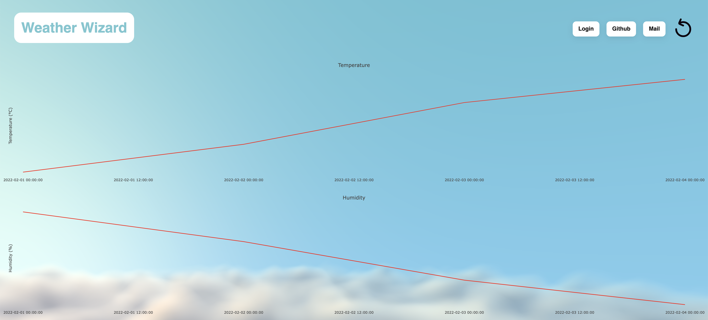
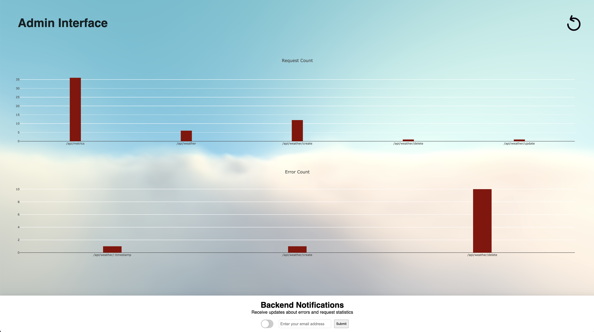
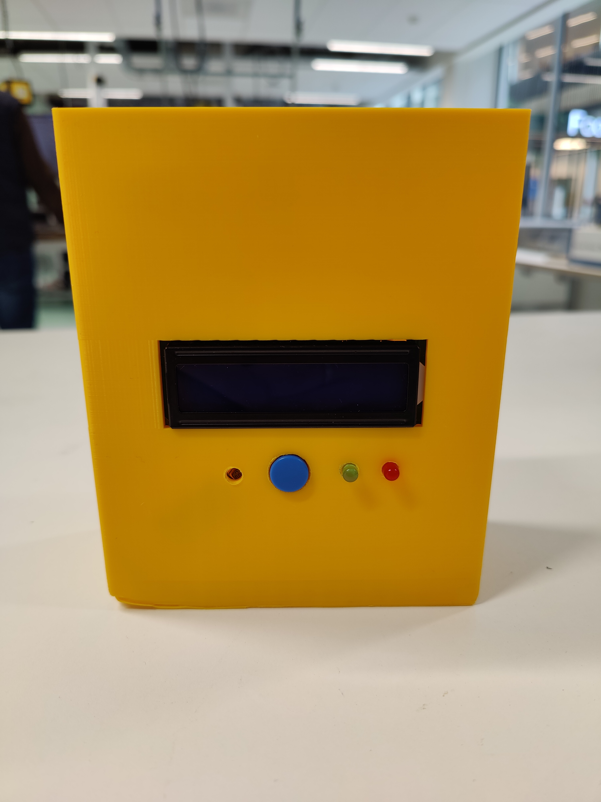

# WeatherWizard

WeatherWizard is an Internet of Things (IoT) project that collects and analyzes weather data in real-time. The project is designed to provide users with accurate and up-to-date weather information, as well as insights into climate trends over time.

# Features

- Collects weather data in real-time
- Displays weather data on a web page
- Admin panel to manage the WeatherWizard
- Email notifications
- API Route analytics
- Provides insights into climate trends over time

### Weather measurements:

### Admin panel:

### Embedded device:

# Getting Started
Clone the WeatherWizard repository and to and follow the instructions provided in the [User manual](./user_manual.md).

# Documentation

The documentation of the project is divided into the following sections:

### General:
- [User manual](./user_manual.md)
- [Architecture overview](./architecture_overview.md)

### Embedded device:
- [System requirements](./system_requirements.md)
- [Software](./emb_software.md)
- [Wiring Diagram & BOM](./bom.md)

### Web application:
- [Database](./db.md)
- [Frontend](./frontend.md)
- [Backend API](./backend.md)
- [New Backend](./improvement.md)

### Physical design:
- [Concept](./physical_design.md)
- [Creation](./creation.md)
- [Failures](./failures.md)

### Research:
- [Research question](./research_question.md)
- [Research](./research.md)
- [Backend implementation](./improvement.md)
- [Changelog](./changelog.md)

# License
WeatherWizard is released under the [Apache License 2.0](./LICENSE).