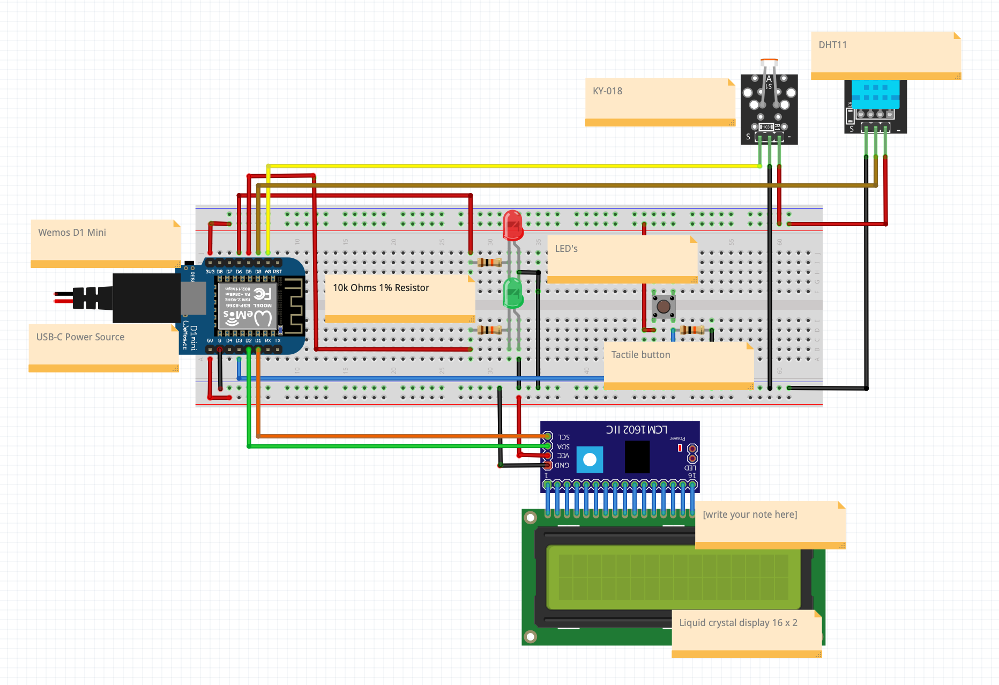

# Wiring Diagram

This wiring diagram gives a visual representation of an electrical circuit or system that shows the physical connections between its components and wires. It uses symbols and shapes to depict the different electrical components and their interconnections. By using wiring diagrams, electricians and engineers can understand and troubleshoot complex electrical systems easily.

# Bill of Materials

This Bill of Materials (BOM) is a comprehensive list of all the materials, components, and instructions needed to produce Weather Wizard. BOM's are commonly used in manufacturing, product development, and engineering to plan purchases, estimate costs, control inventory, and minimize production delays and waste.

| Part Number | Part Name                          | Part Description                                                                                        | Part Quantity    | Manufacturer | Part Cost | URL                                                                                                                                                                   |
|------------|------------------------------------|---------------------------------------------------------------------------------------------------------|------------------|-------------|-----------|-----------------------------------------------------------------------------------------------------------------------------------------------------------------------|
| /          | LED set                            | 0.5W 8Mm 5 Kleur Ultra-Heldere Led Wit Geel Blauw Groen Rood Licht Lamp Emitting diodes Hoge Helderheid | 1                | HESAI            | € 0,01    | https://de.aliexpress.com/item/32822066523.html?spm=a2g0o.detail.1000060.3.5ec230b65zopxh&gps-id=pcDetailBottomMoreThisSeller&scm=1007.13339.291025.0&scm_id=1007.13339.291025.0&scm-url=1007.13339.291025.0&pvid=bcf3775a-8a61-4cdd-ab27-df98c804d4f2&_t=gps-id%3ApcDetailBottomMoreThisSeller%2Cscm-url%3A1007.13339.291025.0%2Cpvid%3Abcf3775a-8a61-4cdd-ab27-df98c804d4f2%2Ctpp_buckets%3A668%232846%238113%231998&pdp_ext_f=%7B%22sku_id%22%3A%2212000032066866119%22%2C%22sceneId%22%3A%223339%22%7D&pdp_npi=3%40dis%21EUR%211.15%210.01%21%21%21%21%21%400b0a172716787307666904139e1fb5%2112000032066866119%21rec%21NL%21&gatewayAdapt=glo2deu    |   
| 10k resistor          | Resistors                          | Set of 20 10K Ohm resistors                                                                             | 1                | GOHJMY            | € 0,12    | https://de.aliexpress.com/item/1005003276086924.html?spm=a2g0o.productlist.main.7.13436d75nXi7sh&algo_pvid=e5a98beb-ff5a-4663-90e8-5f283222099f&algo_exp_id=e5a98beb-ff5a-4663-90e8-5f283222099f-3&pdp_ext_f=%7B%22sku_id%22%3A%2212000024976850338%22%7D&pdp_npi=3%40dis%21EUR%210.13%210.12%21%21%21%21%21%402145280e16787312636361123d06eb%2112000024976850338%21sea%21DE%210&curPageLogUid=BX8uVJN877hB |
| 1602a      | LCD Display 16*2                   | Shows characters with white text and blue backlight                                                     | 1                | QAPASS      | € 4       | https://www.tinytronics.nl/shop/en/displays/lcd/lcd-display-16*2-characters-with-white-text-and-blue-backlight                                                        |
| KY-015     | KY-015 DHT11                       | Temperature and Humidity Sensor                                                                         | 1                | KEYES       | € 2,60    | https://www.prolectra.nl/home/301-ky-015-dht11-temperature-and-humidity-sensor-module.html                                                                            |
| 001204    | TACT12X12X7.3MM                    | Tactile Pushbutton Switch Momentary 4pin                                                                | 1                | UNKNOWN     | € 0,25    | https://www.tinytronics.nl/shop/en/switches/manual-switches/pcb-switches/tactile-pushbutton-switch-momentary-4pin-12*12*7.3mm                                         |
| ESP8266    | Wemos D1 Mini V4                   | TYPE-C USB Wifi Internet Of Things Board Based ESP8266                                                  | 1                | BOLANTEDZ   | € 2,35    | https://nl.aliexpress.com/item/1005004527213280.html?algo_exp_id=cbd77092-a5a4-4505-a8da-561d4a6cba6f-3&pdp_ext_f=%7B%22sku_id%22%3A%2212000029481036792%22%7D        |
| 000071    | BB830P                             | Breadboard with 830 pins                                                                                | 1                | UNKNOWN     | € 4       | https://www.tinytronics.nl/shop/en/tools-and-mounting/prototyping-supplies/breadboards/breadboard-830-points                                                          |
| i2c        | I2C Twi Spi Serial Interface Board | 1602A Backpack                                                                                          | 1                | TZT         | € 1,22    | https://nl.aliexpress.com/item/32649843103.html?algo_exp_id=bbaa2466-27f8-4762-9e32-49db6fb5d61d-0&pdp_ext_f=%7B%22sku_id%22%3A%2259624803836%22%7D                   |
| 000544    | DUPOMM10                           | DuPont Jumper wire Male-Male 10cm 10 wires                                                              | 2  / 20 in total | DUPONT      | € 0,50    | https://www.tinytronics.nl/shop/en/cables-and-connectors/cables-and-adapters/prototyping-wires/dupont-compatible-and-jumper/dupont-jumper-wire-male-male-10cm-10-wires |
