# Physical Design - Create

(Reviewer Luca(not me))

## Requirements

The most important requirements are for me:

- The device should be able to withstand the weather conditions in the Netherlands
- Weather Wizard should have cutouts for the sensors, button, led's and the LCD screen
- The casing should be easy to assemble after printing
- The casing should be easy to print
- Weather Wizard should provide a lot of space to be expandable with more sensors
- The casing should have a ventilation hole to guarantee accurate sensor readings

## Testing

Criteria I can test:

- The casing should be easy to assemble after printing -> You just have to plug in sensors, button, led's and the LCD screen and
glue the roof on the casing

- Measurements -> All the components fit in the casing as shown later in the final design

- Aesthetics -> The casing looks nice and is easy to print

- Ventilation for sensor readings -> The casing has a ventilation hole at the bottom of the casing

- Rain test -> I put the casing in the shower, and it was still working after 10 minutes

- Drop test -> I dropped the casing from 1 meter for 30 times, and the casing was still intact

- Space for expansion -> The casing has a lot of space to be expandable with more sensors

- Assembly -> Weather Wizard is very easy to print. The files for the 3D-printer are provided and it is easy to assemble afterwards


## Prototype

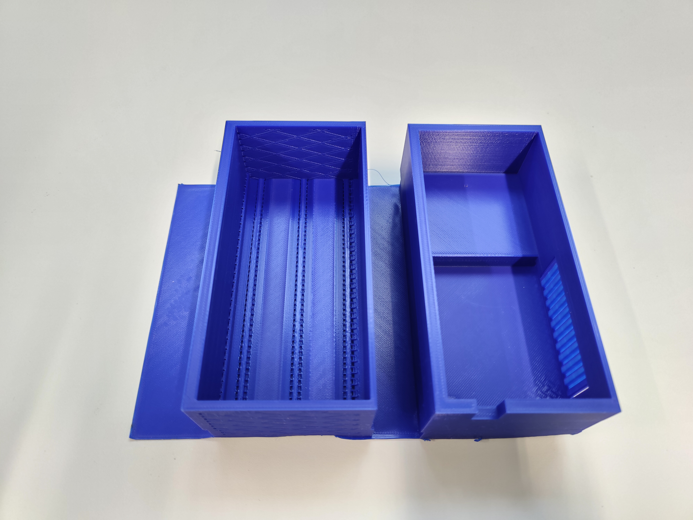

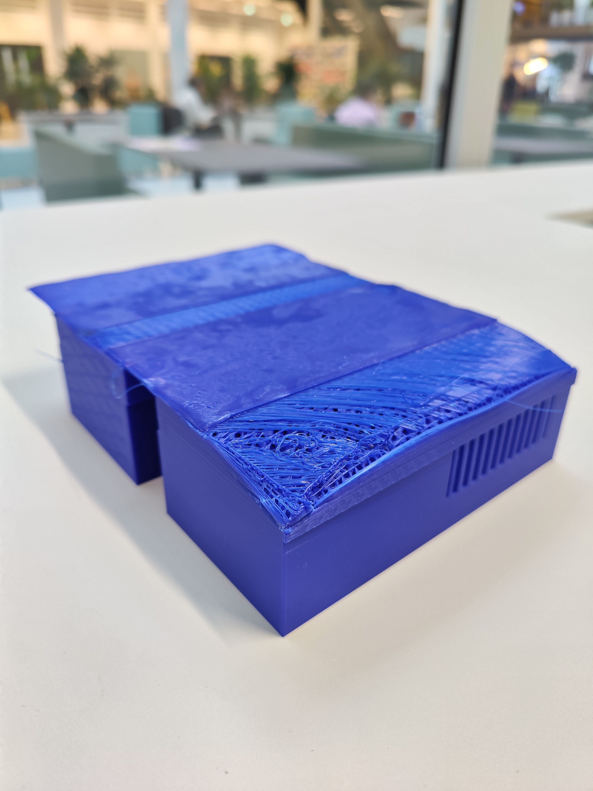

Although this prototype already looks quite good. I still want to make some changes to the casing. The changes include: 

- Merging the two smaller cases into one big case to make it easier to print and assemble

- Putting the ventilation hole at the bottom of the casing, so rainwater can't get inside the casing like before

- Removing the holes from the print, but instead drill the holes in the casing after printing which is easier to do and more accurate

- Improve printing quality -> The bottom of the prototype is not printed well, so I want to improve the printing quality


## Final Design

First, after merging the the two smaller cases and adding the ventilation at the bottom, this was the design:

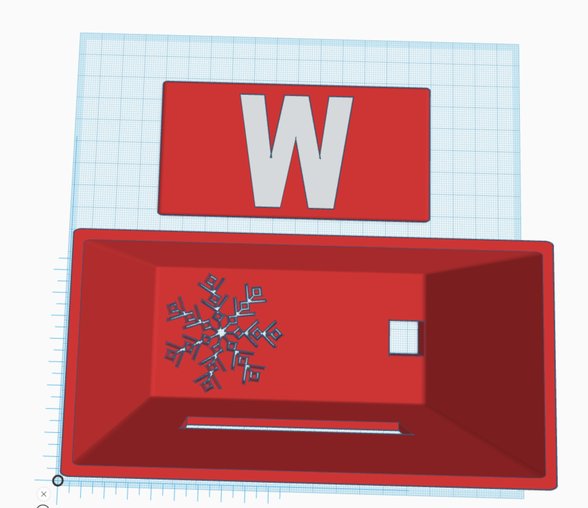

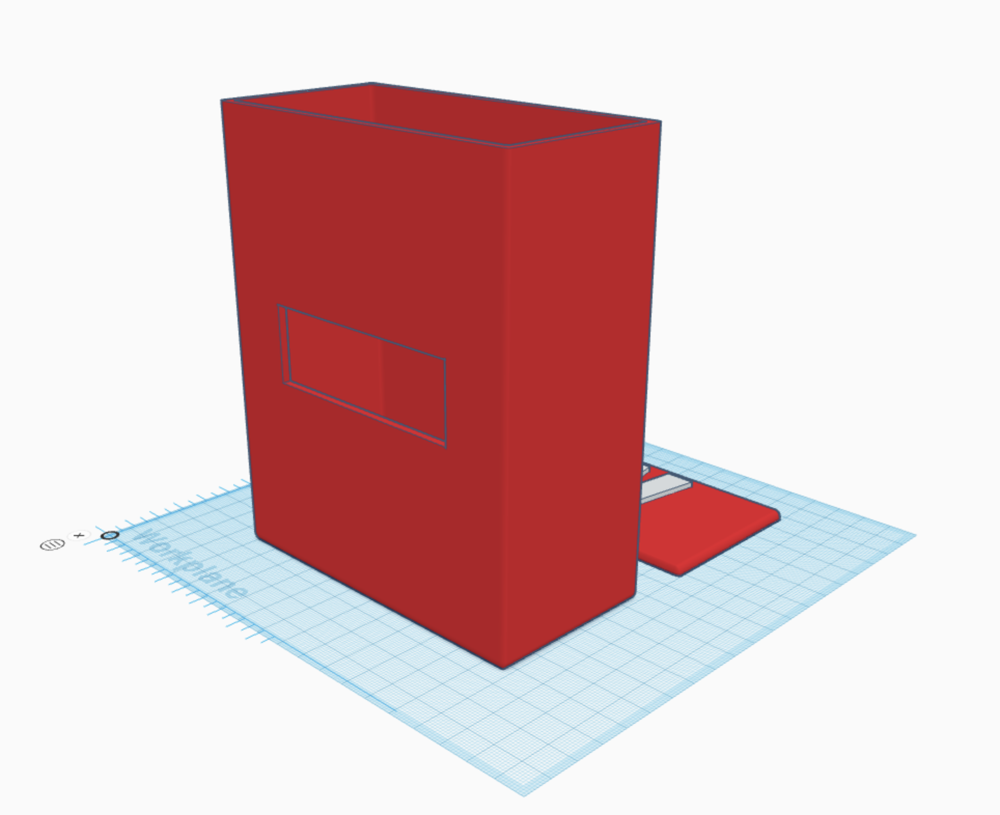

A snowflake made a great shape for the ventilation hole, because it was easy to print and was fitting for a weather station. The
W on the top of the casing stands for Weather Wizard. The other cutout at the bottom is for the cable of the Wemos d1 mini.

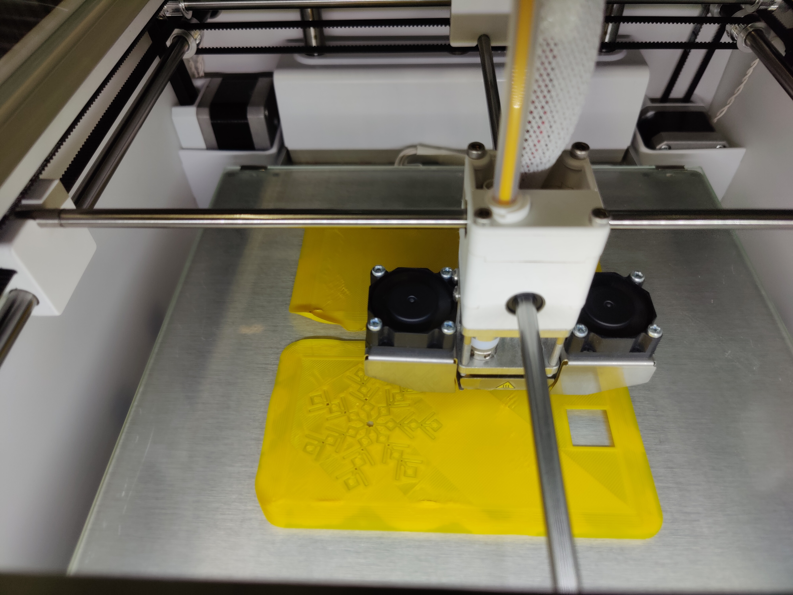

This was the first print of the casing. Although the print had some imperfections, it was good enough for the final version.
I used a 0.2 mm layer height and 20% infill. The print took about 17 hours and 30 minutes. The print was made with PLA filament.
I used auto generated support for the snowflake and the hole of the lcd screen. The support was easy to remove afterwards. The whole 
casing was printed on a brim, so it would stick to the build plate. The Cura slicer was used for the slicing and the printer was a
Ultimaker 2+ Connect.


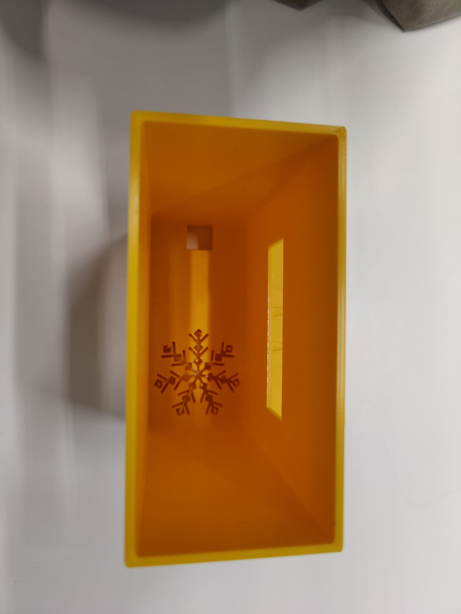

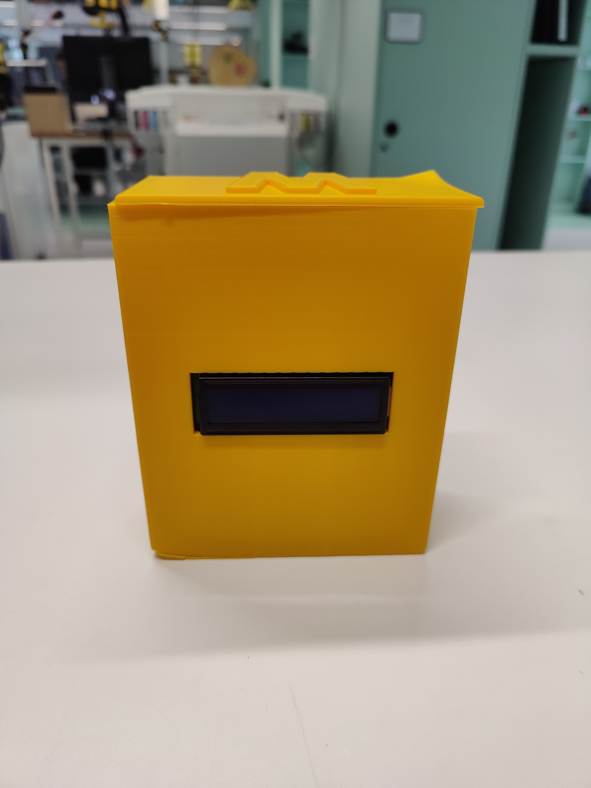


This was the first look of the casing after printing and inserting the lcd screen.

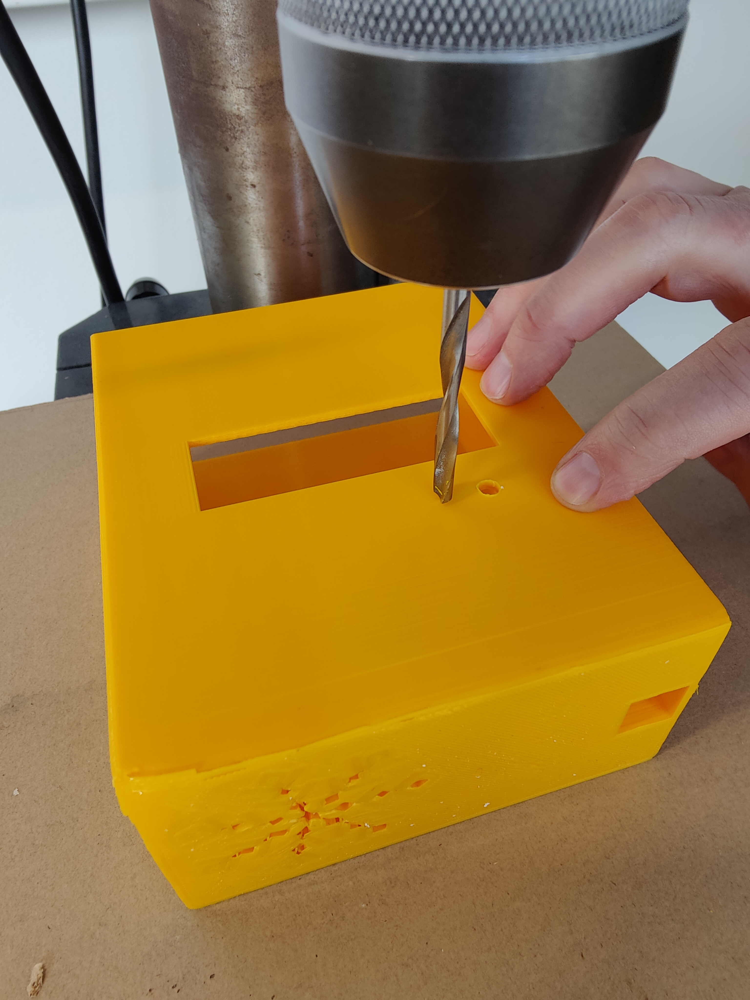

Next, I still had to drill the holes for the sensors, button, led's and the LCD screen. Firstly, I measured the length of the components
and marked the holes on the casing. Then I compared the measurements with the drill bits I had. I used a 3mm and 5 mm drill bit for the
the sensors and led's. The button needed the 5 mm drill bit. It is important that a drill bit for plastic is used, otherwise you will
damage the drill bit. 

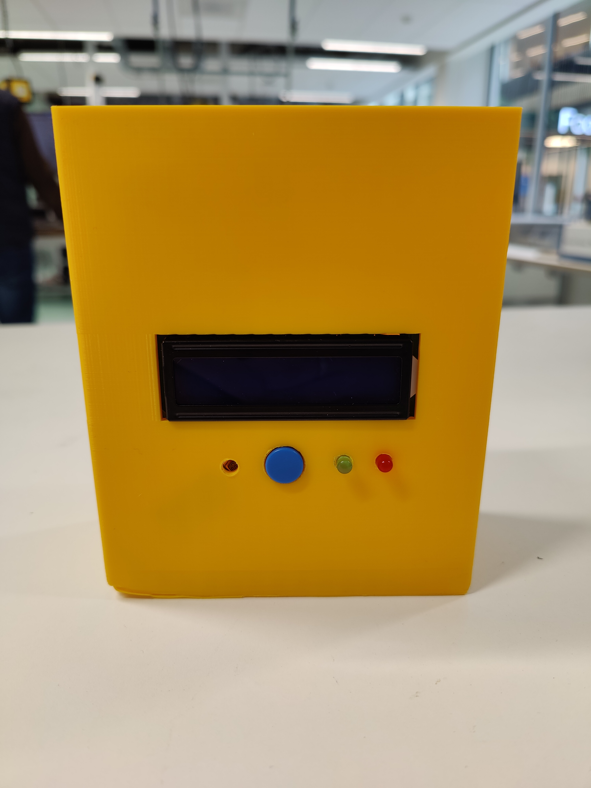

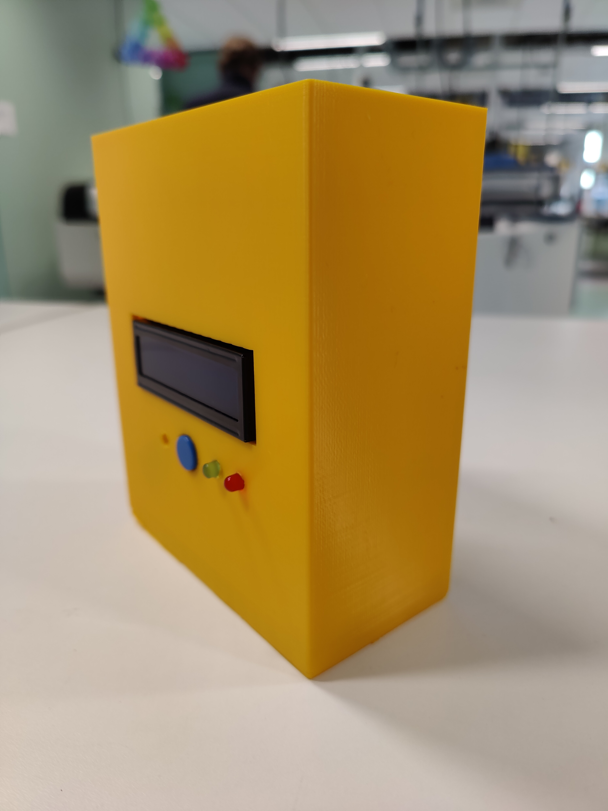

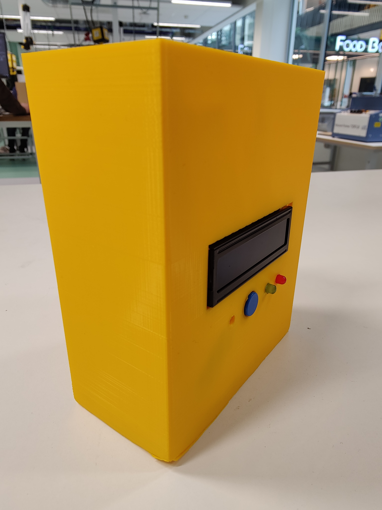

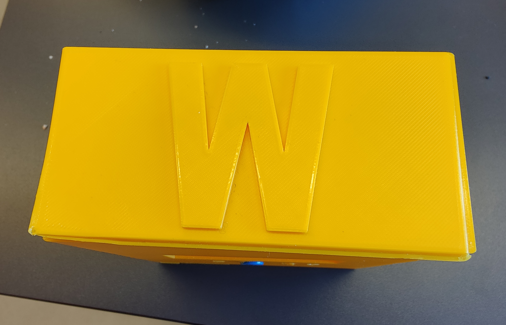

For the final version, I would glue the components with hot glue to make sure they don't fall out of the casing, but 
for now I duck taped them in the casing, because I still want to use the components after the project.

## Manufacturing process

I printed in with the quality setting, which already took 17 hours and 30 minutes. To have more detail you could print with the smallest nozzle, but
this would take more than 24 hours to print and would cost way too much time for the blueprint phase.

#### Chosen material 

I chose PLA yellow Ultimaker filament, because:

- It is easy to print with
- It is easy to remove the support
- It is easy to glue the components in the casing
- It is easy to drill the holes in the casing
- It is environmentally friendly
- It is cheap
- It allows for a wide range of colors and finishes

#### Manufactoring device

The main reason, because I printed with the Ultimaker 2+ Connect, is because it was the main printer of the Makerslab, but it is also a good printer.

Most of its special features, I didn't even have to use:

- Single extrusion with swappable nozzles
-  Cloud-enabled remote 3D printing
-  Filter up to 95% of UFPs (optional)
-  Print with 9 materials (including PP & PC)


#### Logging of the manufacturing process is described

Of course, I could only log the beginning of the print and the final product of the print, because the print always was running the whole night.


#### Files

The stl files contain the basic structure of the file and the 
ufp files contain the additional information for the printer. 
The ufp files are used to print the casing with the Ultimaker 2+ Connect.


The files can be found here in the root of the repo:
```
./physical-design
```

Prototype files:

- [Prototype.ufp](./physical-design/prototype.ufp)
- [Prototype 0.1.stl](./physical-design/prototype%200.1.stl)
- [Prototype 0.15.stl](./physical-design/prototype%200.15.stl)
- [Prototype 0.2.stl](./physical-design/prototype%200.2.stl)
- [Prototype 0.25.stl](./physical-design/prototype%200.2%20rotated.stl)

Final design: 
- [Final Design.ufp](./physical-design/Weather%20Wizard%20Final.ufp)
- [Final Design.stl](./physical-design/Weather%20Wizard%20Final.stl)

#### Optimisations during the manufacturing process:

- During the print one of the early models was not compatabile with the printer, because the required support was too big for the printer, and coudln't be removed afterwards. So I had to redesign the casing to make it compatible with the printer.
- I drilled the holes of the casing, instead of printing them, because it was easier to do, more accurate and allowed more flexibility for the components.
- After using the printing option with the smallest nozzle, which took longer than 24 hours, I decided to use the normal quality option, which took 17 hours and 30 minutes. This was a good compromise between time and quality, because
the quality was good enough for the final version.


#### Future possible Optimisations

- For mass production, I would use a different printer, because the Ultimaker 2+ Connect is not the fastest printer, and it is not the cheapest printer, but also including the holes in the casing 
would make the assembly easier and more accurate.

- More accurate holes for the components

- Glue the components in the casing with hot glue

- More accurate printing quality, could be achieved by printing with a smaller nozzle size


#### Reached Requirements

All the mentioned requirements are reached, except for the easy printing, because the time to print is quite long. But the print is easy to assemble afterwards. 

