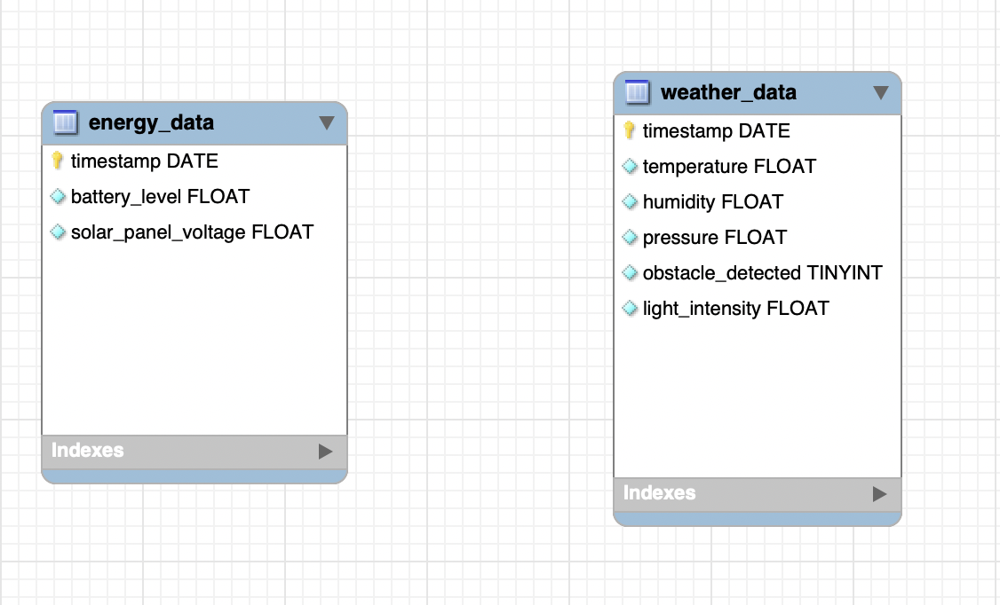

# __Database__
## __Structure__

### __Table: weather_data__

- __timestamp__ (date, primary key): unique identifier for each record</br>
- __temperature__ (float): measured temperature in Celsius</br>
- __humidity__ (float): measured relative humidity in percentage</br>
- __light_intensity__ (float): measured light intensity in Lux</br>
- __pressure__ (float): measured barometric pressure</br>
- __obstacle_detected__ (boolean): Can be used to see if the weather station is covered</br>

  
---

### __Table: energy_data__

- __timestamp__ (date, primary key): unique identifier for each record</br>
- __battery_level__ (float): current battery level in percentage
- __solar_panel_voltage__ (float): measured solar panel voltage in volts

---

## __ER-diagram__




//Because appearntly MySQL Workbench is very buggy and old, I can't change some of the column's datatypes


## __ReBuild script__

```sql
DROP TABLE IF EXISTS `WS`.`energy_data`;
DROP TABLE IF EXISTS `WS`.`weather_data`;

CREATE TABLE IF NOT EXISTS `ws`.`energy_data`(
    `timestamp` DATE NOT NULL,
    `battery_level` FLOAT NOT NULL,
    `solar_panel_voltage` FLOAT NOT NULL,
    PRIMARY KEY(`timestamp`)
); 

CREATE TABLE IF NOT EXISTS `ws`.`weather_data`(
    `timestamp` DATE NOT NULL,
    `temperature` FLOAT NOT NULL,
    `humidity` FLOAT NOT NULL,
    `pressure` FLOAT NOT NULL,
    `obstacle_detected` BOOLEAN NOT NULL,
    `light_intensity` FLOAT NOT NULL,
    PRIMARY KEY(`timestamp`)
);
```

__1:__ First connect to your machine and select the database you want to use. 
Execute the SQL script by typing the following command:

``` bash
source /path/to/your/file/create_tables.sql;
```


__2:__ After executing the script, you can check that the tables were created successfully by typing the following command:

```sql
SHOW TABLES;
```

__3.__ You should see three tables: data, energy_data, and weather_data.

## __Insert script__

To add some data to the tables, you can use the following script:

```sql
INSERT INTO `ws`.`energy_data` (`timestamp`, `battery_level`, `solar_panel_voltage`) 
VALUES ('2022-02-01', 0.85, 14.2),
       ('2022-02-02', 0.87, 12.8),
       ('2022-02-03', 0.89, 11.5),
       ('2022-02-04', 0.90, 10.2);

INSERT INTO `ws`.`weather_data` (`timestamp`, `temperature`, `humidity`, `pressure`, `obstacle_detected`, `light_intensity`) 
VALUES ('2022-02-01', 21.5, 65.2, 1015.7, 0, 1024.8),
       ('2022-02-02', 22.1, 61.8, 1016.2, 0, 1025.1),
       ('2022-02-03', 23.0, 57.4, 1016.4, 1, 1025.5),
       ('2022-02-04', 23.5, 54.6, 1016.7, 1, 1025.8);
```


