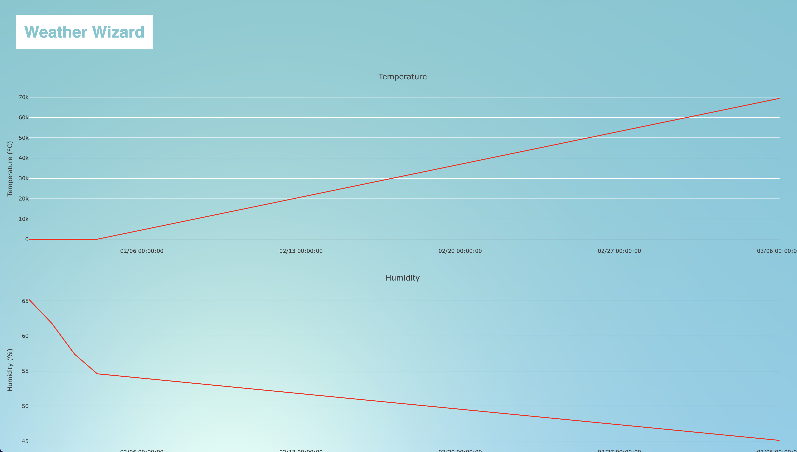

# Frontend

The frontend is the visible user interface of the Weather station the user can interact with.

## __User Interface__

The user interface follows a minimalistic approach. The user interface follows a minimalist design approach. Both the logo and the background of the website have cool animations. The websites uses Plotly to display the data in the graphs.
First we create an trace with data-points. Then we create a layout for the graph. The layout contains the design parameters of the graph.

There are four different graphs which show: Humidity, Light intensity, Temperature and Air pressure  

The website uses a ThreeJS background that is part of VantaJS, which is configured like this:

## __Ajax__

The website uses Ajax to update the graphs. The graphs are updated every 10 seconds. The graphs are updated by sending a request to the backend. The backend then sends the data to the frontend. The frontend then reads the received data and updates the graphs with the new data.

## __Modern css__

The website uses a flexbox as required to make the website more responsive. The four main graphs are part of a flexbox:

## __Full Page__

