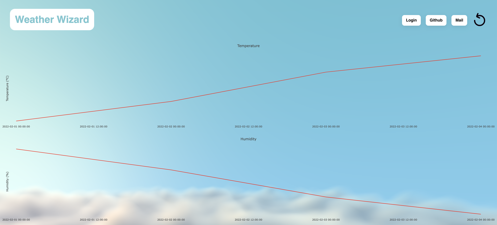
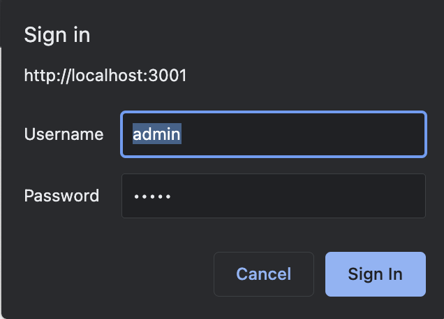
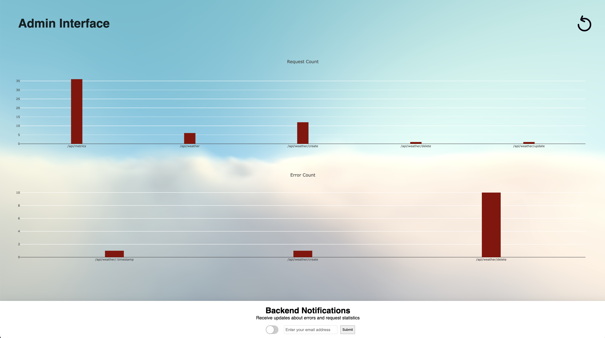

# Improvements

My research focused on the backend of Weather Wizard. I wanted to implement the best possible backend in the given timeframe. In the
following I will explain the improvements I made.

## DOCUMENTATION

Im using Golang language for the backend of Weather Wizard. before talking about the implementation of the backend, I will explain the language itself.
Golang is a compiled language, which means that the code is compiled to machine code before it is executed. This makes it much faster than interpreted languages like PHP.
Golang is also a statically typed language, which means that you have to define the type of variable when you declare it. This makes it easier to find bugs in your code.
It is also garbage collected language like Java, which means that you don't have to worry about memory management like in C or C++. The garbage collector will clean up after you.
Furthermore, Golang is a concurrent language, which means that you can run multiple threads at the same time. This is very useful for web development, since you can run multiple
requests at the same time. It is language that is very easy to learn and has a lot of useful features. This makes it a very popular language for backend development and also the reason
why I wanted to learn it.

Because Golang is a very popular language for backend development, there are a lot of libraries available for backend development. I used the following libraries for this project:

These are the rather regular libraries that I used for this project, which dont need much explanation:

- encoding/json: Functions for encoding and decoding JSON data.
-  fmt: Formatted I/O functions for I/O and string-based operations.
-  log: A straightforward logging package with basic logging features.
-  net/url: Methods for modifying URL components and parsing URLs.
-  encoding/base64: Helps to convert data into base64 format and vice versa.
-  io/ioutil: Functions for basic I/O utility activities like reading and writing files.
-  os and path/filepath: Tools for working with the file system and operating system, including file manipulation.
-  Regexp: Regular expression working functions.
-  time: Time, durations, and date-related functions.


These are the libraries that are a bit more important for this project:

-  Fiber: A fast, simple, and minimalist web framework for Go. 
- Gorm: An ORM library for Golang. It helps to work with databases, specifically PostgreSQL.
- fatih/color: Makes it easy to add colors to text in the console.
- sync: Helps to coordinate tasks and protect shared resources. 
- Sendgrid: A library for sending emails. 
- fatih/color: Makes it easy to add colors to text in the console. 

Why I picked specifically these libraries over others is compared in the research assignment.

Next to these libraries, I also used the following other technologies:

- PostgreSQL: A relational database management system setup in a docker container.
- Docker: A container platform.
- Docker-compose: A tool for defining and running multi-container Docker applications.
- Sendgrid: A service for sending emails.
- Air: A live reload tool for Go applications. 
- Grafana: A tool for visualizing data.
- Insomnia: A tool for testing tool for http, websockets and graphql requests.


Why I picked them specifically is again compared in the research assignment.

Since I added around 1000 lines of code, I will only focus on the most important parts of the source code and not too much on language specific
details. The starting point of the backend is the main file and its main function as you might know it from
Java or C#. 

First there are two global variables declared, which are the dbManager and the fiberApp. Thet get initialized in the initBackend function and
are created with the New functions The new functions is similar to the constructor in Java or C#. It returns a new object of the given type and also initializes it.
The DBManager in this case is initialized with the NewDBManager function. This function takes 2 parameters, the database type and the connection string. 
The fiberApp is initialized with a seperate function. This is because the fiberApp now listens for requests and is blocking the main thread.

```go
package main

var dbManager *DBManager
var fiberApp *FiberApp

func main() {
	initBackend()
}

func initBackend() {
	//new db manager object
	dbManager = NewDBManager("Postgres", "host=localhost port=5432 user=postgres password=postgres dbname=postgres sslmode=disable")
	dbManager.GetInfo()
	dbManager.setupDb()

	//new fiber app object
	fiberApp = NewFiberApp()
	fiberApp.InitFiber() //This must be the last thing since it starts the server
}
```

I will continue next with the DBManager. This is a important part of the backend, since it is responsible for all database related tasks. 
This Function is creating a new DBManager object and also initializes it. It takes 2 parameters, the database type and the connection string.
It sets up the postgres database connection with the gorm library. 

```go
func NewDBManager(name string, dsn string) *DBManager {
	var d = DBManager{db: nil, name: name, insertSql: "insert.sql", rebuildSql: "rebuild.sql"}

	var err error
	d.db, err = gorm.Open(postgres.Open(dsn), &gorm.Config{})
	if err != nil {
		d.LogError("Failed to connect database")
	}

	d.Log("Connected to database")

	return &d
}
```


This the struct of the object. It contains the database connection, the name of the database, the insert sql file and the rebuild sql file.

```go
type DBManager struct {
	db         *gorm.DB
	name       string
	insertSql  string
	rebuildSql string
}
```

The function called afterwards is the GetInfo function. This function returns information about the DBManager. This function is only used to ensure that the DBManager is initialised correctly.

```go
func (d *DBManager) GetInfo() {
d.Log(fmt.Sprintf("%+v", d))
}
```

It is one of many utility functions and getters and setters that I added to the DBManager and the fiberAPP to make it easier to develop and debug the backend:

```go

func (d *DBManager) SetDBManager(db *gorm.DB, name string) {
	d.SetName(name)
	d.SetDB(db)
}

func (d *DBManager) SetDB(db *gorm.DB) {
	d.db = db
}

func (d *DBManager) SetName(name string) {
	d.name = name
}

func (d *DBManager) GetDB() *gorm.DB {
	return d.db
}

func (d *DBManager) GetName() string {
	return d.name
}

func (d *DBManager) ToString() string {
	return fmt.Sprintf("Running %s ", d.name)
}
```

But there is also other functionality which I can't show completely. Most of them have some functionality that are not very relevant for the project itself, but make extension, debugging and testing much better:


_Logs all the weather data from the database to the console_

```go
func (d *DBManager) logWeatherData() {
	// Initialize a slice of maps to store the weather data
	var data []map[string]interface{}

	// Find the weather data from the "weather_data" table
	result := d.db.Table("weather_data").Find(&data)

	// Check if there was an error while finding the data
	if result.Error != nil {
		// Log the error message
		d.Log(result.Error.Error())
		return
	}

	// Check if no rows were affected (i.e. no data was found)
	if result.RowsAffected == 0 {
		// Log a message indicating that no data was found
		d.Log("No weather data found")
		return
	}

	// Loop through the data and log each item as a JSON string
	for _, item := range data {
		// Convert the map to a JSON string
		jsonString, err := json.Marshal(item)

		// Check if there was an error while converting to JSON
		if err != nil {
			// Log the error message
			d.Log(err.Error())
			continue
		}

		// Log the JSON string
		d.Log(string(jsonString))
	}
}
```

Two setup functions which run sql files to first create tables and then insert data into them:

```go
func (d *DBManager) runSqlSetupFiles() {
	// Check if the specified SQL file exists
	sqlFilePath := filepath.Join(".", "sql", d.rebuildSql)
	if _, err := os.Stat(sqlFilePath); os.IsNotExist(err) {
		// If the file does not exist, log an error message
		d.LogError(fmt.Sprintf("SQL file '%s' not found", sqlFilePath))
		return
	}

	// Read the contents of the SQL file
	sqlBytes, err := ioutil.ReadFile(sqlFilePath)
	if err != nil {
		// If there was an error reading the file, log the error message
		d.LogError(err.Error())
		return
	}
	sql := string(sqlBytes)

	// Execute the SQL statements contained in the file
	if err := d.db.Exec(sql).Error; err != nil {
		// If there was an error executing the SQL, log the error message
		d.LogError(err.Error())
		return
	}

	// Log a message indicating that the SQL was executed successfully
	d.Log("Executed " + d.rebuildSql)
}

func (d *DBManager) fillDB() {
	// Define a function to be executed when the main function returns (i.e. in case of panic)
	defer func() {
		if r := recover(); r != nil {
			// If a panic occurred, log a message indicating that the database fill failed
			d.Log(fmt.Sprintf("Failed to fill database: %s", r))
		}
	}()

	// Check if the specified SQL file exists
	sqlFilePath := filepath.Join(".", "sql", d.insertSql)
	if _, err := os.Stat(sqlFilePath); os.IsNotExist(err) {
		// If the file does not exist, panic with an error message
		panic(fmt.Sprintf("SQL file '%s' not found", sqlFilePath))
	}

	// Read the contents of the SQL file
	sqlBytes, err := ioutil.ReadFile(sqlFilePath)
	if err != nil {
		// If there was an error reading the file, panic with the error
		panic(err)
	}
	sql := string(sqlBytes)

	// Execute the SQL statements contained in the file
	if err := d.db.Exec(sql).Error; err != nil {
		// If there was an error executing the SQL, panic with the error
		panic(err)
	}

	// Log a message indicating that the SQL was executed successfully
	d.Log("Executed " + d.insertSql)
}
```

This function logs all the tables which we created to the console:

```go
func (d *DBManager) logAllTables() {
	// Execute a raw SQL query to retrieve the names of all tables in the "ws" schema
	rows, err := d.db.Raw("SELECT table_name FROM information_schema.tables WHERE table_schema = 'public'").Rows()
	if err != nil {
		// If there was an error executing the query, log the error message
		d.Log(err.Error())
	}

	// Initialize a string to store the log message
	var log = "Tables: "

	// Loop through the query results
	for rows.Next() {
		var table_name string
		rows.Scan(&table_name)
		// Append the table name to the log message
		log += table_name + ", "
	}

	// Log the log message
	d.Log(log)
}
```

But to get to the most important part of the database manager, we have to look at the CRUD functions. These functions are used to create, read, update and delete data from the database and are essential for the Rest API.

To manipulate all data from the database I used a GORM model which is a struct that represents a table in the database. The ORM is defined in like this:


```go 
// WeatherData ORM 
type WeatherData struct {
	Timestamp        time.Time `gorm:"column:timestamp"`
	Temperature      float64   `gorm:"column:temperature"`
	Humidity         float64   `gorm:"column:humidity"`
	Pressure         float64   `gorm:"column:pressure"`
	ObstacleDetected bool      `gorm:"column:obstacle_detected"`
	LightIntensity   float64   `gorm:"column:light_intensity"`
}
```

Next we have different functions which are used to manipulate data:


This function is used to gather all weather data from one specific timestamps and returns like all of my CRUD functions a JSON string:
```go
func (d *DBManager) GetWeatherDataByTimestampJSON(timestamp string) (string, error) {
	// Validate the format of the input timestamp using a regular expression
	validTimestamp := regexp.MustCompile(`^\d{4}-\d{2}-\d{2}T\d{2}:\d{2}:\d{2}Z$`)
	if !validTimestamp.MatchString(timestamp) {
		// Return an error if the format is invalid
		return "", fmt.Errorf("Invalid timestamp format: %s", timestamp)
	}

	// Parse the timestamp string into a time.Time value
	timestampParsed, err := time.Parse(time.RFC3339, timestamp)
	if err != nil {
		// Return the error if there was a problem parsing the timestamp
		return "", err
	}

	// Retrieve the weather data with the specified timestamp
	var weatherData WeatherData
	result := d.db.Table("weather_data").Where("timestamp = ?", timestampParsed).First(&weatherData)
	if result.Error != nil {
		// Return the error if there was a problem retrieving the data
		return "", result.Error
	}

	// Check if no rows were affected (i.e. no data was found)
	if result.RowsAffected == 0 {
		// Return a message indicating that no data was found
		return "No weather data found for the specified timestamp", nil
	}

	// Marshal the weather data into a JSON string
	weatherDataJSON, err := json.Marshal(weatherData)
	if err != nil {
		// Return the error if there was a problem marshaling the data
		return "", err
	}

	// Return the JSON string
	return string(weatherDataJSON), nil
}
```

In contrast, this function returns all weather data from the database, not just one specific timestamp:
```go
func (d *DBManager) GetAllWeatherDataJSON() ([]byte, error) {
	// Retrieve all weather data records
	var data []WeatherData
	result := d.db.Table("weather_data").Find(&data)
	if result.Error != nil {
		// Return the error if there was a problem retrieving the data
		return nil, result.Error
	}
	if result.RowsAffected == 0 {
		// Return an error if no data was found
		return nil, errors.New("no weather data found")
	}

	// Marshal the weather data into a JSON string
	jsonData, err := json.Marshal(data)
	if err != nil {
		// Return the error if there was a problem marshaling the data
		return nil, err
	}

	// Return the JSON string
	return jsonData, nil
}
```

Of course, we also want to be able to delete data. This function uses a timestamp to delete a specific weather data record:
```go
func (d *DBManager) DeleteWeatherDataJSON(jsonStr string) (string, error) {
	// Unmarshal the JSON string into a struct
	var data struct {
		Timestamp string `json:"timestamp"`
	}
	err := json.Unmarshal([]byte(jsonStr), &data)
	if err != nil {
		// Return the error if there was a problem unmarshaling the JSON
		return "", err
	}

	// Parse the "timestamp" field into a time.Time value
	timestamp, err := time.Parse(time.RFC3339, data.Timestamp)
	if err != nil {
		// Return the error if there was a problem parsing the timestamp
		return "", err
	}

	// Delete the weather data with the specified timestamp
	result := d.db.Table("weather_data").Where("timestamp = ?", timestamp).Delete(&WeatherData{})
	if result.Error != nil {
		// Return the error if there was a problem deleting the data
		return "", result.Error
	}

	// Check if no rows were affected (i.e. no data was found)
	if result.RowsAffected == 0 {
		// Return a message indicating that no data was found
		return "No weather data found for the specified timestamp", nil
	}

	// Return a success message
	return "Weather data deleted", nil
}
```

To update data we also need a timestamp to identify the entry we want to update with this function:
```go
func (d *DBManager) UpdateWeatherDataJSON(jsonStr string) (string, error) {
// Unmarshal the JSON string into a `WeatherData` struct
var data WeatherData
err := json.Unmarshal([]byte(jsonStr), &data)
if err != nil {
// Return the error if there was a problem unmarshaling the JSON
return "", err
}

// Retrieve the existing weather data with the same timestamp
existingData := WeatherData{}
result := d.db.Table("weather_data").Where("timestamp = ?", data.Timestamp).First(&existingData)
if result.Error != nil {
// Return the error if there was a problem retrieving the existing data
return "", result.Error
}
if result.RowsAffected == 0 {
// Return a message indicating that no data was found
return "No weather data found for the specified timestamp", nil
}

// Update the existing weather data
result = d.db.Table("weather_data").
Where("timestamp = ?", data.Timestamp).
Updates(WeatherData{
Temperature:      data.Temperature,
Humidity:         data.Humidity,
Pressure:         data.Pressure,
ObstacleDetected: data.ObstacleDetected,
LightIntensity:   data.LightIntensity,
})
if result.Error != nil {
// Return the error if there was a problem updating the data
return "", result.Error
}

// Return a success message
return "Weather data updated", nil
}


```

Lastly, we want to create new weather records. This function takes in a JSON string and creates the record in the database:
```go
func (d *DBManager) CreateWeatherDataJSON(jsonStr string) (string, error) {
// Unmarshal the JSON string into a `WeatherData` struct
var data WeatherData
err := json.Unmarshal([]byte(jsonStr), &data)
if err != nil {
// Return the error if there was a problem unmarshaling the JSON
return "", err
}

// Check if data with the same timestamp already exists
existingData := WeatherData{}
result := d.db.Table("weather_data").Where("timestamp = ?", data.Timestamp).First(&existingData)
if result.RowsAffected > 0 {
// Return a message indicating that the data already exists
return "Weather data already exists for the specified timestamp", nil
}

// Create the weather data
result = d.db.Table("weather_data").Create(&data)
if result.Error != nil {
// Return the error if there was a problem creating the data
return "", result.Error
}

// Return a success message
return "Weather data created", nil
}
```

All these operations are getting called by the FiberApp, the second essential component of the application. The FiberApp is also an object that is instantiated in the main function. 
It is responsible for handling HTTP endpoints, middleware, metrics and authentication. After the DBManager is created the FiberApp follows.

This is the constructor of the FiberApp:
```go
// NewFiberApp constructor for fiber
func NewFiberApp() *FiberApp {
	return &FiberApp{
		fiberApp: fiber.New(),
		metrics:  NewMetrics(),
	}
}
```

The FiberApp consists of a Fiber instance and a metric instance that is used to collect metrics about the application.

The FiberApp has some useful auxiliary functions like the DBManager, but I will not go into these again, only the new functionality.

The main function of the FiberApp is the setupRoutes function. As the name suggests it sets up all the routes of the application. 

I will go step by step through this function to explain what is happening.

First we setup middleware which is used for logging incoming requests and logging outgoing responses. 
It makes it very easy to debug the application and see what is happening. Then we serve the static files of the frontend.
```go
	// add middleware to log input and output for all routes
	f.fiberApp.Use(f.logMiddleware)

	// Serve static files from the "static" directory
	f.fiberApp.Static("/", "./web")
```


### api/weather/:timestamp

After that we set up all the routes of the application. The first route is delivers data from a specific timestamp. All these routes call the CRUD functions in the DBManager.


```go
f.fiberApp.Get("api/weather/:timestamp", func(c *fiber.Ctx) error {
// Get the timestamp from the URL parameters
timestamp := c.Params("timestamp")

// URL-decode the timestamp
decodedTimestamp, err := url.QueryUnescape(timestamp)
if err != nil {
// Return a bad request error if the timestamp format is invalid
return c.Status(fiber.StatusBadRequest).SendString("Invalid timestamp format")
}

// Call the `GetWeatherDataByTimestampJSON` method from the `dbManager` object
weatherData, err := dbManager.GetWeatherDataByTimestampJSON(decodedTimestamp)
if err != nil {
// Increment the error count in the metrics and return the error
f.metrics.IncrementErrorCount(c.Route().Path)
return c.SendString(err.Error())
}

// Increment the request count in the metrics
f.metrics.IncrementRequestCount(c.Route().Path)

// Return the weather data
return c.SendString(weatherData)
})
```
Returns:

```
{
		"Timestamp": "2022-02-03T00:00:00Z",
		"Temperature": 23,
		"Humidity": 57.4,
		"Pressure": 1016.4,
		"ObstacleDetected": true,
		"LightIntensity": 1025.5
}
```
or
```
No weather data found for the specified timestamp
```
or
```
Some kind of error message
```

### api/weather

A GET request to receive all weather data entries.

```go
f.fiberApp.Get("api/weather", func(c *fiber.Ctx) error {
	// Call the GetAllWeatherDataJSON method from the dbManager object
	weatherData, err := dbManager.GetAllWeatherDataJSON()
	if err != nil {
		// If an error occurs, increment the error count for this route
		f.metrics.IncrementErrorCount(c.Route().Path)
		// Return the error message to the client
		return c.SendString(err.Error())
	}

	// Increment the request count for this route
	f.metrics.IncrementRequestCount(c.Route().Path)
	// Return the weather data to the client
	return c.Send(weatherData)
})
```

Returns:
```
[
	{
		"Timestamp": "2022-02-03T00:00:00Z",
		"Temperature": 23,
		"Humidity": 57.4,
		"Pressure": 1016.4,
		"ObstacleDetected": true,
		"LightIntensity": 1025.5
	},
	{
		"Timestamp": "2022-02-04T00:00:00Z",
		"Temperature": 23.5,
		"Humidity": 54.6,
		"Pressure": 1016.7,
		"ObstacleDetected": true,
		"LightIntensity": 1025.8
	},
	{
		"Timestamp": "2022-03-02T00:00:00Z",
		"Temperature": 22.1,
		"Humidity": 63.8,
		"Pressure": 1016.2,
		"ObstacleDetected": false,
		"LightIntensity": 0
	},
	{
		"Timestamp": "2022-02-01T00:00:00Z",
		"Temperature": 31.5,
		"Humidity": 65.2,
		"Pressure": 1094.7,
		"ObstacleDetected": false,
		"LightIntensity": 1024.8
	}
]
```
or
```
Some kind of error message
```

### api/weather/delete

A Delete request to delete an specific entry.

```go
f.fiberApp.Delete("api/weather/delete", func(c *fiber.Ctx) error {
	// Get the JSON data from the request body
	jsonStr := string(c.Body())

	// Call the DeleteWeatherDataJSON method from the dbManager object
	result, err := dbManager.DeleteWeatherDataJSON(jsonStr)
	if err != nil {
		// Increment error count in the metrics object and log the error
		f.metrics.IncrementErrorCount(c.Route().Path)
		fmt.Println("Failed to delete weather data:", err)
		// Return a 500 Internal Server Error status code
		return c.SendStatus(fiber.StatusInternalServerError)
	}

	// If no weather data was found for the specified timestamp
	if result == "No weather data found for the specified timestamp" {
		// Increment error count in the metrics object and return a 404 Not Found status code
		f.metrics.IncrementErrorCount(c.Route().Path)
		return c.SendStatus(fiber.StatusNotFound)
	}

	// Increment request count in the metrics object
	f.metrics.IncrementRequestCount(c.Route().Path)
	// Return a success message
	return c.SendString("Weather data deleted successfully.")
})
```

Returns:

```
Weather data updated
```
or
```
Not Found
```
or
```
Some kind of error message
```

### api/weather/update

And PUT request to update weather data.

```go
f.fiberApp.Put("api/weather/update", func(c *fiber.Ctx) error {
	// Get JSON data from the request body
	jsonStr := string(c.Body())

	// Call the UpdateWeatherDataJSON method from the dbManager object
	result, err := dbManager.UpdateWeatherDataJSON(jsonStr)
	if err != nil {
		// If there is an error, increment the error count and return the error message
		f.metrics.IncrementErrorCount(c.Route().Path)
		return c.SendString(err.Error())
	}

	// If the update was successful, increment the request count
	f.metrics.IncrementRequestCount(c.Route().Path)
	return c.SendString(result)
})
```

Response:

```
Weather data updated
```
or
```
No weather data found for the specified timestamp
```
or
```
Some kind of error message
```

### api/weather/create

```go
// Handle HTTP POST request to the "/api/weather/create" endpoint
f.fiberApp.Post("api/weather/create", func(c *fiber.Ctx) error {
	// Get the JSON data from the request body
	jsonStr := string(c.Body())

	// Call the `CreateWeatherDataJSON` method from the `dbManager` object
	result, err := dbManager.CreateWeatherDataJSON(jsonStr)
	if err != nil {
		// Increment the error count for the current route
		f.metrics.IncrementErrorCount(c.Route().Path)

		// Return the error message
		return c.SendString(err.Error())
	}

	// Increment the request count for the current route
	f.metrics.IncrementRequestCount(c.Route().Path)

	// Return the result of the `CreateWeatherDataJSON` method
	return c.SendString(result)
})
```

Response:

```
Weather data already exists for the specified timestamp
```
 or
```
Weather data created successfully.
```
or 
```
Some kind of error message
```

### api/metrics

A GET request to the `/api/metrics` endpoint returns the metrics in JSON format.

```go
	f.fiberApp.Get("api/metrics", func(c *fiber.Ctx) error {
		// Retrieve metrics from the metrics object
		metrics := f.metrics.GetMetrics()

		// Increment the request count for the api/metrics endpoint
		f.metrics.IncrementRequestCount(c.Route().Path)

		// Return the metrics in JSON format
		return c.JSON(metrics)
	})
```

Response:

```json
{
	"errorCount": {
		"/api/weather/:timestamp": 1
	},
	"requestCount": {
		"/api/metrics": 8,
		"/api/weather": 1,
		"/api/weather/create": 1,
		"/api/weather/delete": 1,
		"/api/weather/update": 1
	}
}
```

### / 

Route which returns the index.html file.

```go
f.fiberApp.Get("/", func(c *fiber.Ctx) error {
		f.metrics.IncrementRequestCount(c.Route().Path)
		//returns main html page
		return c.SendFile("./web/index.html")
	})
```

Returns the main page of the web application:



The Frontend of my page also got some aesthetic improvements, but because my research only focus on the backend I will not cover that.

### /admin 

This route is used to return the admin.html file. I wanted to use at least some basic protection for the admin page, that's why implemented HTTP authentication . Of course this is not the optimal solution, but my research focus is also not 
cybersecurity focused. This is just a basic implementation to prevent unauthorized access to the admin page.

The authentication works like this:
First a json file with credentials is read and parsed into a map. Then we return a middleware function that checks for the Authorization header in the request, if it exists we check if the credentials are correct we return the admin.html file. If there are any errors we return a 401 Unauthorized status code.

```go
func BasicAuth(userFile string, realm string) fiber.Handler {
	// Read the user file into memory and parse it as a map of usernames to passwords
	userBytes, err := ioutil.ReadFile(userFile)
	if err != nil {
		log.Fatal(err)
	}
	users := make(map[string]string)
	if err := json.Unmarshal(userBytes, &users); err != nil {
		log.Fatal(err)
	}

	// Return the middleware function that performs basic authentication
	return func(c *fiber.Ctx) error {
		// Get the Authorization header from the request
		auth := c.Get("Authorization")

		// If the Authorization header is missing, return a 401 Unauthorized response
		if auth == "" {
			c.Status(fiber.StatusUnauthorized)
			c.Set("WWW-Authenticate", fmt.Sprintf(`Basic realm="%s"`, realm))
			return c.SendString("Unauthorized")
		}

		// Decode the Authorization header to get the username and password
		authBytes, err := base64.StdEncoding.DecodeString(strings.TrimPrefix(auth, "Basic "))
		if err != nil {
			c.Status(fiber.StatusUnauthorized)
			c.Set("WWW-Authenticate", fmt.Sprintf(`Basic realm="%s"`, realm))
			return c.SendString("Unauthorized")
		}
		authString := string(authBytes)
		parts := strings.SplitN(authString, ":", 2)

		// If the Authorization header is not in the correct format, return a 401 Unauthorized response
		if len(parts) != 2 {
			c.Status(fiber.StatusUnauthorized)
			c.Set("WWW-Authenticate", fmt.Sprintf(`Basic realm="%s"`, realm))
			return c.SendString("Unauthorized")
		}

		// Check if the username and password match a valid user in the users map
		username := parts[0]
		password := parts[1]
		if storedPassword, ok := users[username]; !ok || storedPassword != password {
			c.Status(fiber.StatusUnauthorized)
			c.Set("WWW-Authenticate", fmt.Sprintf(`Basic realm="%s"`, realm))
			return c.SendString("Unauthorized")
		}

		// If the username and password are valid, call the next middleware function
		return c.Next()
	}
}
```

This is what the authentication looks like:



After entering the right credentials you will be directed to the admin page:




I built the admin page with a similar look like the main page. It shows metrics which are collected by the backend and also allows the user to sign up for the email notification service.

The notification service is built with Sendgrid. After setting up a lot of things on the Sendgrid website, I could get an API key to use their service.

#### /api/notifications

This is the route which is used to set up the email notification service. 

```go
f.fiberApp.Post("/api/notifications", func(c *fiber.Ctx) error {
		// Parse the JSON data into a NotificationConfig struct
		var config NotificationConfig
		if err := c.BodyParser(&config); err != nil {
			return err
		}

		// Set up the email and toggle switch
		setupEmail(config.Email, config.Enabled)

		// Return a success message
		return c.SendString("Email and toggle switch have been set up successfully")
	})
```

Returns:

```
Email and toggle switch have been set up successfully
```
or
```
Some kind of error message
```

The functions which gets called to set up the email works like this:

```go
func setupEmail(e string, en bool) {
email = e
enabled = en
readKey()
stopDailyMailer = make(chan struct{})
if enabled {
go func() {
sendSetupMail(email)
setupDailyMailer(stopDailyMailer)
}()
} else {
disableDailyMailer()
}
}

func sendSetupMail(email string) {
	mail.NewEmail("Luca", "luca.v.kannen@gmail.com")
	subject := "Backend Notifications"
	mail.NewEmail("Luca", email)
	plainTextContent := "You are now subscribed to notifications. The backend will send from now on notifications to " +
		"this email address. You will receive a daily summary of all requests and errors. You can unsubscribe in the Admin Panel."
	htmlContent := "<p>Hi there, you are now subscribed to notifications.</p>\n\n<p>The backend will send from now on notifications to this email address. You will receive a daily summary of all requests and errors.</p>\n\n<p>You can unsubscribe in the Admin Panel."
	sendSummaryMail(email, subject, plainTextContent, htmlContent)
}
```

First a setup mail gets send 


## Architecture

During writing this assignment it is much easier to follow if you have a look at the architecture first.

Main architecture:
3

SUBSTANTIATION.
The improvement proposals are substantiated with explicit links to your research outcomes.

REALISATION.
The realised improvements are documented with code explanations, pictures, videos, etc. on your markdown site.
