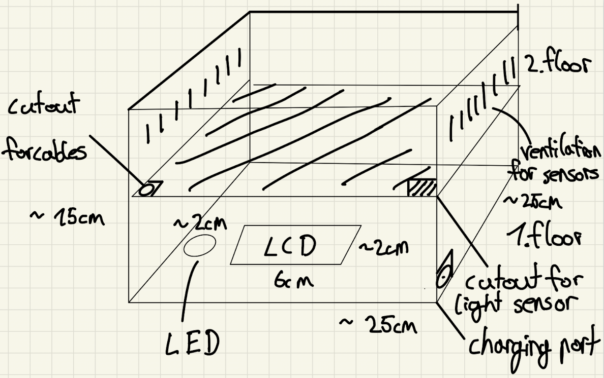

(Reviewed by Rafail)
# Concept

## Target group

The user of the WeatherWizard can be anyone who is interested in monitoring and recording weather data from a specific location. This could include:

- Farmers and agricultural workers who need to track weather patterns for crop management and irrigation purposes.

- Transportation and logistics companies that need to monitor weather conditions to optimize their routes and delivery schedules.

- Construction companies that need to plan their projects around weather conditions.

- Weather enthusiasts who want to track weather data for personal interest or research purposes.

- Government agencies that need to monitor weather conditions for disaster preparedness and response.

## Needs and Goals

- Weather resistance: Since the WeatherWizard is constantly exposed to various weather conditions such as rain, sunlight, wind, etc., the housing should be robust and weather-resistant to protect the sensors and electronics from damage.

- Waterproofing: The enclosure should be waterproof to prevent water from entering the enclosure and damaging the sensors or electronics.

- Space requirement: The enclosure should provide enough space to accommodate all sensors, batteries, and transmission technology.

- Material: The enclosure material should be robust, durable, and corrosion-resistant to ensure a long life for the WeatherWizard -> ABS plastic

- Mounting options: The enclosure should provide suitable mounting options to mount the WeatherWizard in a suitable location, such as on a wall or pole.

- Access to the interior: The housing should allow easy access to the inside to replace or maintain the batteries or electronics if necessary.

- Easy assembly: The enclosure should be easy to assemble, disassemble, and transport, making it convenient for installation and relocation.

- Cost: The enclosure should be cost-effective to ensure that the WeatherWizard can be manufactured at a reasonable price.

- Noise reduction: The housing should be designed to reduce any noise or vibration caused by the sensors or electronics, which can affect the accuracy of the collected data. (Altough there are no moving parts in the WeatherWizard by now)

- Ventilation: The enclosure should be designed to allow for proper ventilation to allow accurate measerments by the sensors.

- Aesthetics: The enclosure should be designed to be aesthetically pleasing to ensure that the WeatherWizard is not an eyesore.

The design is seperated in two floors the first floor is for the main hardware and the second is for the sensors. The reason for that is that some of the sensors need ventilation to make more accurate messearments.

# Digital manufacturing materials and methods

## The chosen device

3D printing is a process in which a digital 3D model is converted into a physical object layer by layer using a 3D printer. To do this, the printer uses different materials, such as plastics or metals, which are applied layer by layer and fused together.

## The chosen material

For the enclosure of the weather station, ABS (Acrylonitrile Butadiene Styrene).  ABS is known for their high strength, durability, and resistance to impact and weathering, making them ideal for protecting the sensitive electronic components of the WeatherWizard from the elements.

## Reasons for the selected production:

- Customizability: 3D printing allows for easy customization of the design of the weather station chassis, enabling the creation of unique and specialized designs to meet specific requirements (Altough the shape is right now very simple, but it might be changed in the future)

- Speed: 3D printing allows for fast production of the weather station chassis, with the ability to print parts on demand and with minimal lead time.

- Cost-effective: 3D printing is a cost-effective option for producing a small casing the weather station chassis (The final draft of the weather station which is currently printing, costed me 10 euro's)

- Durability: 3D printing allows for the production of durable parts that can withstand the elements and last for a long time.

## Disadvantages of the selected production:

- Limited material choices: While 3D printing has come a long way in terms of materials, the range of available materials is still limited compared to traditional manufacturing methods.
- Hard to repair: 3D printing is not suitable for repairing broken parts.
- Hard to recycle: 3D printing is not suitable for recycling.
- Limited print size: The size of 3D printed objects is limited by the size of the 3D printer.
- Limited production speed: 3D printing can be a slow process, especially for large objects.

# DIGITAL DESIGN

## Chosen software

First I used Tinkedcad, but later switched to FreeCAD. I used FreeCAD because it is more powerful and has more features. Tinkercad might be better for beginners, but FreeCAD is more suitable for more complex designs.

Update: Unfortunately I had to switch back to Tinkercad because FreeCAD learning curve is too steep for the time I have left.

## Stages of the design process

1. Determine the purpose and requirements of the casing
2. Take accurate measurements
3. Create a 3D model of the object using CAD software
4. Select the appropriate printer and material
5. Slice the 3D model into layers using slicing software
6. Set the printing parameters, such as the layer height and printing speed
7. Send the sliced model to the 3D printer and start the printing

