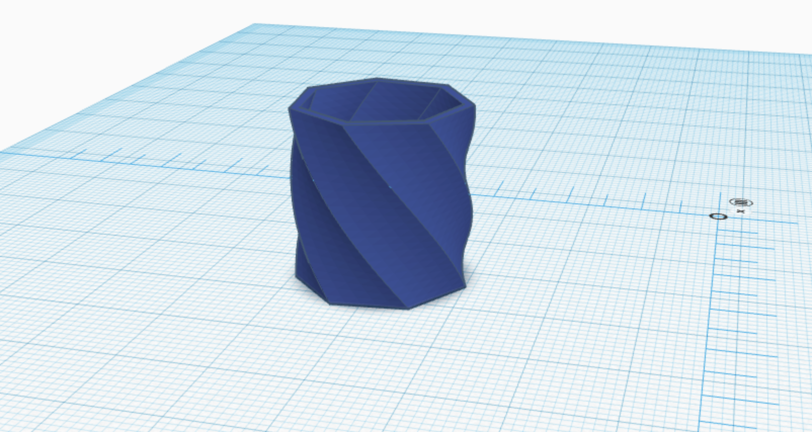
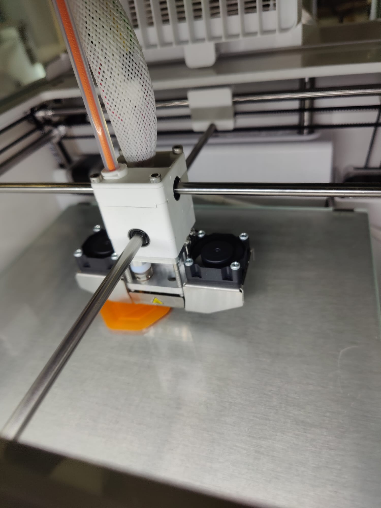
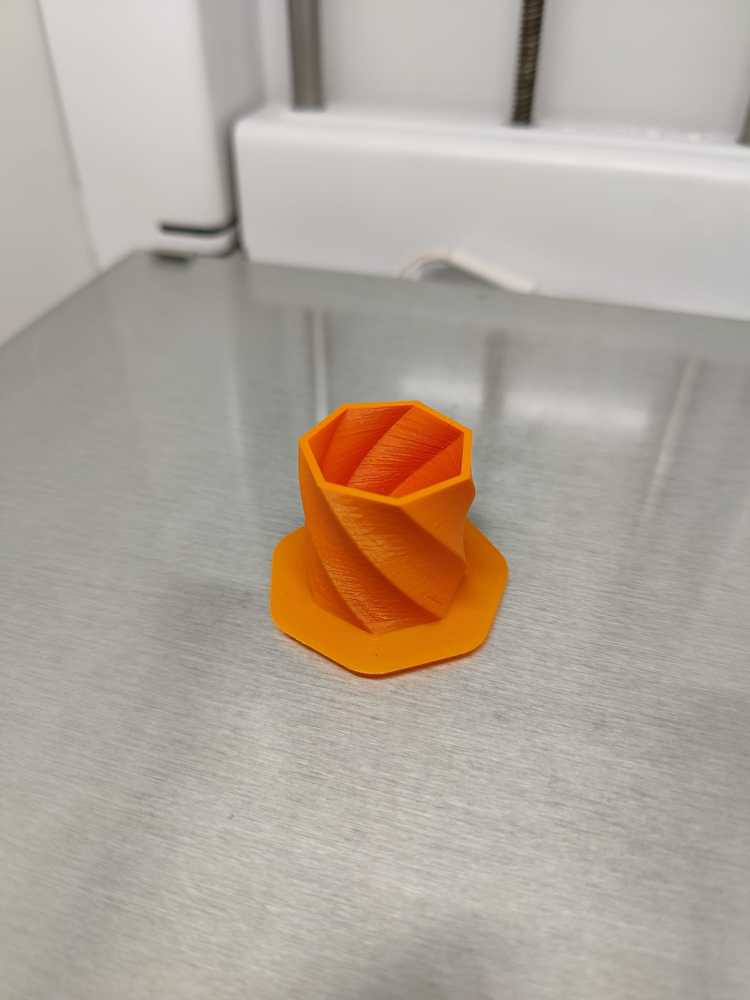

# Physical design

## Concept and Requirements

- Weather resistance: Since the weather station is constantly exposed to various weather conditions such as rain, sunlight, wind, etc., the housing should be robust and weather-resistant to protect the sensors and electronics from damage.

- Waterproofing: The enclosure should be waterproof to prevent water from entering the enclosure and damaging the sensors or electronics.

- Space requirement: The enclosure should provide enough space to accommodate all sensors, batteries and transmission technology.

- Material: The enclosure material should be robust, durable and corrosion resistant to ensure a long life for the weather station. Plastics such as ABS or polycarbonate and metals such as aluminium or stainless steel are good options.

- Mounting options: The enclosure should provide suitable mounting options to mount the weather station in a suitable location, such as on a wall or pole.

- Access to the interior: The housing should allow easy access to the inside to replace or maintain the batteries or electronics if necessary.

## Digital manufacturing materials and methods

## Design

## Prototype

## Create

## Conclusion

# Failures

### First draft and expermenting with 3D-printing

This is the first draft of the enclosure. It is made of 15mm thick ABS plastic and is printed on a Ultimaker 3D printer. It was designed with TinkerCAD. 

- ### First draft and expermenting with 3D-printing

- ### First draft and expermenting with 3D-printing

- ### First draft and expermenting with 3D-printing
