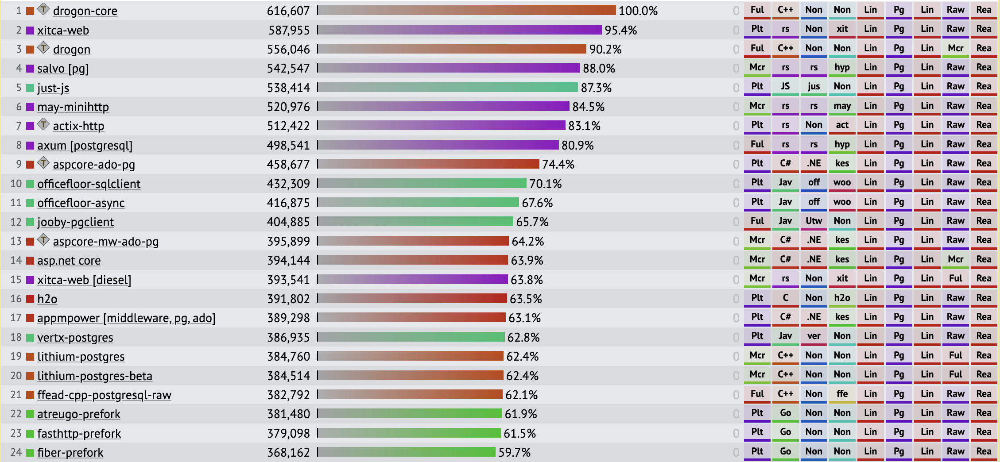

# How can Golang be used to implement a better backend for Weather Wizard?

Go, often referred to as Golang is an open-source programming language that was developed by Google in 2009.
Go is gaining a lot of popularity in the last years and has become one of the most popular languages for backend development.

## What makes the language special?

Many features of Go's make it a great choice for that. Go is a compiled language, which means that it is actually converted to machine code before it is executed.
This makes it a lot faster than interpreted languages like PHP. Another great feature of Golang is its Garbage Collector. This makes it a lot easier to
manage memory in Go. Most other compiled languages require you to manually manage your memory, which can be a lot of work and is very error-prone.
Furthermore, Go is a statically typed language, which means that you have to define the type of variable when you declare it, which makes it a lot easier to
find errors in your code before runtime. The easy syntax of Go also makes it a lot easier to learn than other languages. The syntax of Go
is very similar to C and Python, which makes it easy to switch between those languages. The last feature that I want to mention is the concurrency of Go.
Golang has very good support for concurrency. That means that you run multiple tasks at the same time. This is very useful for backend development,
since it allows you to handle many requests and perform multiple tasks simultaneously,what improves performance and responsiveness.

For all those reasons many companies have switched to Golang for their backend development. Here are some examples:

- Uber: Uber heavily relies on Golang for backend development, notably its dispatch system and map services. Uber can handle a huge number of requests concurrently thanks to Golang's concurrency characteristics, making it simpler to deliver a smooth experience for its consumers.

- Dropbox: Dropbox's desktop client, which manages file syncing between devices, is written in Golang. The desktop client can sync data rapidly and effectively thanks to Golang's fast execution speeds and concurrency characteristics.

- Docker: Docker is a popular containerization program that heavily relies on Golang.

## For whom is this research relevant?

This researches target audience are developers who want to create high-performance, scalable, and concurrent applications. Golang is especially well-suited for developing microservices, APIs, and web servers. Because of its simplicity and speed, it is also a popular choice for building DevOps tools like as continuous integration and deployment (CI/CD) systems.

## What are methods and sources to research this question?

Since this research question can be interpreted very broadly, I will have to narrow it down. I will focus on the following topics:

- What libraries could be used?
- What are modern features of Golang?
- What is the best architecture for a backend in Golang?

These topics will be researched by reading literature, watching videos and trying out the language myself. Other sources of information I want to use are the official documentation of Golang, case studies and performance benchmarks.

## What are libraries that could be used?

Since Golang is very popular for backend development, there are also a lot of libraries available for it. 

To get familiar with good libraries which are offered in the Goland ecosystem, I can recommend the following Github page:
https://github.com/avelino/awesome-go

It contains a list of the most popular libraries and frameworks for Golang. It is structured by category, so it is easy to find the right library for your use cases.

https://madappgang.com/blog/backend-development-with-golang/

For weather wizard we need the following types libraries to build a modern backend:

https://kinsta.com/blog/postgresql-vs-mysql/#:~:text=MySQL%20is%20a%20purely%20relational,%2C%20ACID%2Dcompliant%20storage%20engine.
#### Database: 
https://survey.stackoverflow.co/2022/
Since we already have a sql database it makes sense to use another sql database. I decided to pick PostgreSQL, because it is a very popular and modern database. It has a lot of features that make it subjectively better than MySQL. It is also open-source and free to use. 
The stackoverflow developer survey 2022 shows that PostgreSQL is one of the most popular databases for backend development.

https://github.com/mingrammer/go-web-framework-stars
#### Web-framework: 
The most popular and most used web-framework for Golang is currently Gin, but after doing some research I decided to pick Fiber.
Fiber is a better choice than Gin due to its better performance, nicer syntax, and more comprehensive documentation.
https://www.youtube.com/watch?v=10miByMOGfY&t=735s
The strong performance is also shown in the TechEmpower benchmarks.The benchmark is consists of three parts. 

1. Database access: The test demands the web application to connect to a database, get records, and execute specified operations on the data.

2. Server-side templating: After retrieving records from the database, the web application must generate an HTML view using server-side templates. This tests the framework's ability to handle dynamic HTML creation.

3. JSON serialization: The test requires the web application to serialize data into JSON format, which tests the framework's JSON handling skills.

Fiber is the third fastest web-framework for Golang, with only rather smaller and less popular frameworks being faster.
It is also the 24. fastest web-framework for all languages. https://www.techempower.com/benchmarks/#section=data-r21&test=fortune
For me, it was also easier to get started with Fiber, because I was already familiar Express.js, which is a similar web-framework for Node.js.

#### ORM (Object Relational Mapping): https://github.com/go-gorm/gorm
https://blog.bitsrc.io/what-is-an-orm-and-why-you-should-use-it-b2b6f75f5e2a
ORM is a technique that allows you to query and manipulate data from a database using an object-oriented paradigm.
Using an ORM allows developers to leverage their fluency in a programming language, simplifying database interactions and abstracting away SQL complexities. It offers easy database system switching, advanced built-in features, and often leads to better-performing queries than hand-written SQL. It is typically recommended for small to allow teams to increase their productivity.

Monitoring and Logging:
For monitoring the most popular frameworks are Prometheus and Grafana. Both are open-source and free to use. You can deploy them in a docker container and connect them to your application.
After setting them up you can see the performance of your application in real-time. You can also set up alerts, so you get notified if something goes wrong.
https://prometheus.io/docs/introduction/overview/
https://grafana.com/docs/

An example of a dashboard that you can create with Grafana:
 
https://grafana.com/

For logging, a logging framework doesnt have to be used for a small scale project like Weather Wizard. The standard library of Golang already provides a good logging framework.
https://betterstack.com/community/guides/logging/logging-framework/
For bigger projects it is recommended to use a proper logging framework. The most popular and widely used logging framework is Logrus. https://github.com/sirupsen/logrus
https://betterprogramming.pub/awesome-logging-in-go-with-logrus-70606a49f285
Logrus supports a variety of output formats, log levels, and hooks, as well as structured logging. Its adaptability and extensibility make it an excellent choice for a wide range of applications.

### Authentication
https://dev.to/kcdchennai/how-jwt-json-web-token-authentication-works-21e7
https://developer.mozilla.org/en-US/docs/Web/HTTP/Authentication
For authentication, the most popular token based authentication is JWT. JSON Web Tokens (JWTs) are a widely used modern standard for securely exchanging data between parties. JSON Web Tokens are often used to authenticate users and convey authorization information and consist of a header, payload, and signature. A JWT's header provides information about the hashing technique used to sign the token, and the payload contains the actual data being transferred. The signature ensures the token's integrity and prevents manipulation. JWTs are adaptable and simple to implement, and they may be used in a broad range of applications and use situations. Although for a small scale project like Weather Wizard, a more simplistic authentication method can also be used. 
Basic authentication is a simple authentication scheme built into the HTTP protocol. The client sends HTTP requests with the Authorization header that contains the word Basic word followed by a space and a base64-encoded string username:password. The server decodes the base64 string, splits the string into the username and password components, and verifies that the given credentials are valid. Basic authentication may not be very feature rich, but it is very easy to implement. It also doesn't require any additional libraries. It's only draw is that it doesn't offer confidentiality, so the password is sent in plain text, but this can be mitigated by using HTTPS instead of HTTP. 

### Testing:

The most popular testing framework for Golang is Testify, but most Golang developers stated in the JetBrains survey, that they prefer the standard library of Golang for testing.
https://www.jetbrains.com/research/devecosystem-2018/go/
https://www.jetbrains.com/lp/devecosystem-2022/go/
Altogether, the standard library of Golang is very good and provides all the necessary tools for testing. It is also very easy to use and has a good documentation.
Testify can be used if more advanced features are needed, but for a small scale project like Weather Wizard, the standard library is sufficient.
Testify has a lot of features like mocking, assertions, and test suites. 

## What architecture pattern should be used?
https://www.atlassian.com/microservices/microservices-architecture/microservices-vs-monolith#:~:text=A%20monolithic%20architecture%20is%20a,monolith%20architecture%20for%20software%20design
https://www.datadoghq.com/knowledge-center/serverless-architecture/#:~:text=Serverless%20architecture%20is%20an%20approach,storage%20systems%20at%20any%20scale.

Before you can implement a new backend, you should decide what architecture pattern you want to use. There are two main architecture patterns that are relevant for this project. The first one is the monolithic architecture and the second one is the microservices' architecture.

### Microservices' architecture:
Microservice architecture is an architectural approach in which an application is divided into smaller, autonomous services that communicate with one another using APIs. This method enhances scalability, flexibility, and fault separation while also making deployment and maintenance easier. Nevertheless, it can result in additional complexity and administrative overhead, higher infrastructure and operating expenses, and more challenging end-to-end functionality testing.

### Monolithic architecture:
Monolithic architecture is an architectural style in which an application is constructed as a single, cohesive system. This technique encourages simplicity, quicker development and testing, and improved speed owing to fewer network calls. Nevertheless, it can limit scalability and flexibility, have weaker fault isolation and resilience, and be more complex to deploy and manage. It also provides limited support for polyglot development, which allows various programming languages and technologies to be utilized for different areas of the application.

## References
