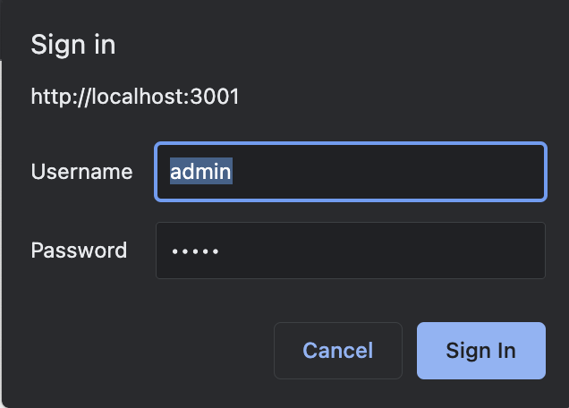

# How can Golang be used to implement a better backend for Weather Wizard?

In the first version of Weather Wizard, we used PHP for the backend. PHP is very popular, has great community support
is used in a lot of projects and is easy to learn. However, there are more modern languages which are coming up and
offer
plenty of benefits over old languages. One of those languages is Go.

Go, often referred to as Golang is an open-source programming language that was developed by Google in 2009.
Go is gaining a lot of popularity in the last years and has become one of the most popular languages for backend
development. The languages philosophy is to be simple, fast and efficient.

## For whom is this research relevant?

The target audience for this research are developers and engineers who are interested in using Golang for backend
development in small scale or personal projects.

## What are methods and sources to research this question?

To narrow down the research question, I will focus on the following topics:

- What are the benefits of developing in Golang?
- What libraries and technologies can be used for backend development in Golang?
- What is the best architecture for a Weather Wizard backend in Golang?

These topics will be researched by reading articles and developer blogs, watching videos and tutorials and by analyzing
surveys and benchmarks.

## What are the benefits of developing in Golang?

Many features of Go's make it a great choice for backend development. Go is a compiled language, which means that it is
actually
converted to binary before it is executed on a machine
This makes it a lot faster than other languages which use an interpreter. Another great feature of Golang is its Garbage
Collector. The Garbage Collector makes it much easier to
manage memory in Go. Most other compiled languages require you to manually manage your memory, which can be a lot of
work and is very error-prone. Microsoft estimated that 70% of all security breaches are caused by bad memory
management. https://msrc.microsoft.com/blog/2019/07/a-proactive-approach-to-more-secure-code/
Furthermore, Go is a statically typed language, which means that you have to define the type of variable when you
declare it, which makes it a lot easier to
find errors in your code before
runtime and also increases the speed of execution.https://instil.co/blog/static-vs-dynamic-types/#:~:text=Protection%20from%20Runtime%20Errors,a%20much%20smoother%20development%20experience.
The easy syntax of Go also makes it a lot easier to learn than other languages.
The syntax of Go
is very similar to C, which makes it easy to switch languages. The last feature that I want to
mention is the concurrency of Go.
Golang has very good support for concurrency. That means that you run multiple threads and processes at the same time. This is very
useful for backend development,
since it allows you to handle many requests and perform multiple tasks simultaneously,what improves performance and
responsiveness.
https://medium.com/@julienetienne/why-go-the-benefits-of-golang-6c39ea6cff7e

For all those reasons many companies have switched to Golang for their backend development. Here are some examples:

- Uber: Uber heavily relies on Golang for backend development, notably its dispatch system and map services. Uber can
  handle a huge number of requests concurrently thanks to Golang's concurrency characteristics, making it simpler to
  deliver a smooth experience for its consumers.
  https://www.uber.com/en-NL/blog/aresdb/
- Dropbox: Dropbox's desktop client, which manages file syncing between devices, is written in Golang. The desktop
  client can sync data rapidly and effectively thanks to Golang's fast execution speeds and concurrency characteristics.
  https://dropbox.tech/infrastructure/open-sourcing-our-go-libraries
- Docker: Docker uses Golang to implement its core container runtime, as well as various other components such as the
  Docker CLI and Docker Compose.
  https://news.ycombinator.com/item?id=6709517

And there are many more examples, like Netflix, Meta, Cloudflare and of course Google itself. Most developer teams have
said that they switched to Golang because of its performance and concurrency characteristics.
https://go.dev/solutions/case-studies

### Drawbacks of Golang

Even though Golang has many great features, it also has some drawbacks.

- Lack of Generics: Golang lacks the functionality of Generics. This can limit developers in some use cases, because Generics allow you very easily to
  create reusable code. 

- A smaller standard library compared to other programming languages: Golang has a standard library, but it is fairly
  small compared to other programming languages that have had years to establish a big ecosystem of libraries. Thus, to
  complete certain tasks, programmers often need to employ libraries third party sources.

- Unique Syntax: Some developers can find the syntax of Golang a bit strange. It is quite different compared to more widely used languages like Java or Python.

## What libraries and technologies can be used for backend development in Golang?

Since Golang is very popular for backend development, there are also a lot of libraries available for it.

To get familiar with good libraries which are offered in the Goland ecosystem, I can recommend the following Github
page:
https://github.com/avelino/awesome-go

It contains a list of the most popular libraries and frameworks for Golang. It is structured by category, so it is easy
to find the right library for your use cases. It is also very well maintained and updated frequently.

https://madappgang.com/blog/backend-development-with-golang/

For weather wizard we need the following types of libraries and technologies to build a modern backend:

https://kinsta.com/blog/postgresql-vs-mysql/#:~:text=MySQL%20is%20a%20purely%20relational,%2C%20ACID%2Dcompliant%20storage%20engine.

#### Database:

https://survey.stackoverflow.co/2022/
Since we already worked with MySQL it makes sense to use another sql database. I decided to pick PostgreSQL, because
it is a very popular and modern database. It has a lot of features that make it subjectively better than MySQL. Of
course, it is
also open-source and free to use. The stackoverflow developer survey 2022 shows that PostgreSQL is the most popular
database under professional developers. It is also the most
popular database for backend development.

Nevertheless, there is not a big one decisive reason why I should pick one of the popular sql databases over the others
Almost all popular sql databases, which are not deprecated, are very good and have a lot of features.

NoSQL databases on the other hand would require us to change our whole data model, which is not worth the effort.

https://github.com/mingrammer/go-web-framework-stars

#### Web-framework:

The most popular and most used web-framework for Golang is currently Gin, but after doing some research I decided to
pick Fiber. Fiber is a better choice than Gin due to its better performance, nicer syntax, and more comprehensive
documentation.
https://www.youtube.com/watch?v=10miByMOGfY&t=735s
The strong performance is also shown in the TechEmpower benchmarks.The benchmark consists of three parts.

1. Database access: The test demands the web application to connect to a database, get records, and execute specified
   operations on the data.

2. Server-side templating: After retrieving records from the database, the web application must generate an HTML view
   using server-side templates. This tests the framework's ability to handle dynamic HTML creation.

3. JSON serialization: The test requires the web application to serialize data into JSON format, which tests the
   framework's JSON handling skills.

Fiber is the third fastest web-framework for Golang, with only rather small and less popular frameworks being faster.
It is also the 24. fastest web-framework for all
languages. Gin is only the 162. fastest web-framework.
https://www.techempower.com/benchmarks/#section=data-r21&test=fortune
For me, it was also easier to get started with Fiber, because I was already familiar Express.js, which is a similar
web-framework for Node.js.

#### ORM (Object Relational Mapping): https://github.com/go-gorm/gorm

https://blog.bitsrc.io/what-is-an-orm-and-why-you-should-use-it-b2b6f75f5e2a
ORM is a technique that allows you to query and manipulate data from a database using an object-oriented paradigm.
Using an ORM allows developers to leverage their fluency in a programming language, simplifying database interactions
and abstracting away SQL complexities. It offers easy database system switching, advanced built-in features, and often
leads to better-performing queries than handwritten SQL. It is typically recommended for small projects to make rapid
development easier.

#### Monitoring and Logging and Notification:

For monitoring the most popular frameworks are Prometheus and Grafana. Both are open-source and free to use. You can
deploy them in a docker container and connect them to your application.
After setting them up you can see the performance of your application in real-time like here:
https://prometheus.io/docs/introduction/overview/
https://grafana.com/docs/grafana/latest/introduction/

https://grafana.com/

You can also set up alerts, so you get notified if something goes wrong.

For logging, a logging framework doesn't have to be used for a small scale project like Weather Wizard. The standard
library of Golang already provides a good logging framework.
https://betterstack.com/community/guides/logging/logging-framework/
For bigger projects it is recommended to use a proper logging framework. The most popular and widely used logging
framework is calledLogrus. https://github.com/sirupsen/logrus
https://betterprogramming.pub/awesome-logging-in-go-with-logrus-70606a49f285
Logrus supports a variety of output formats, log levels, and hooks, as well as structured logging. Its adaptability and
extensibility make it an excellent choice for a wide range of applications.

Grafana, Prometheus, as well as a different notification system, are both capable of implementing notifications. Email,
Slack, Telegram, and other messaging systems are all capable of implementing the notifications.

Because setting up a mail server is not necessary, I choose to use an email provider for the alerts. SendGrid is the
most well-known email provider that also allows for Golang programming. It is also quite simple to start up and gives a
free tier with 100 free emails each day.
https://rapidapi.com/blog/email-apis-which-one-is-right-for-you/

### Authentication

https://dev.to/kcdchennai/how-jwt-json-web-token-authentication-works-21e7
https://developer.mozilla.org/en-US/docs/Web/HTTP/Authentication
For authentication, the most popular modern token based authentication is JWT. JSON Web Tokens (JWTs) are a widely used
standard for securely exchanging data between parties. JSON Web Tokens are often used to authenticate users and prove
authorization information and consist of a header, payload, and signature. JWTs are adaptable and simple to implement,
and they can be
used in a broad range of applications and use situations. Although for a small scale project like Weather Wizard, a more
simplistic authentication method can also be used. Basic authentication is a simple authentication scheme built into the
HTTP protocol. The client sends HTTP requests with
the Authorization header that contains the word Basic word followed by a space and a base64-encoded string username:
password. The server decodes the base64 string, splits the string into the username and password components, and
verifies that the given credentials are valid. Basic authentication may not be very feature rich, but it is very easy to
implement. It also doesn't require any additional libraries. It's only draw is that it doesn't offer confidentiality, so
the password is sent in plain text, but this can be mitigated by using HTTPS instead of HTTP.

The implementation of Basic authentication looks like this:

### Testing:

The most popular testing framework for Golang is Testify, but most Golang developers stated in the JetBrains survey,
that they prefer the standard library of Golang for testing.
https://www.jetbrains.com/lp/devecosystem-2022/go/
Altogether, the standard library of Golang is very good and provides all the necessary tools for testing. It is also
very easy to use and has a great documentation.
Testify can be used if more advanced features are in need, but for a small scale project, the
standard library is sufficient.
Testify has a lot of features like mocking, assertions, and test suites.

## What is the best architecture for a Weather Wizard backend in Golang?

https://www.atlassian.com/microservices/microservices-architecture/microservices-vs-monolith#:~:text=A%20monolithic%20architecture%20is%20a,monolith%20architecture%20for%20software%20design

You should choose the architectural pattern before you may create a new backend. For this project, there are primarily
two architectural patterns that matter. The monolithic architecture is the first, while the architecture of
microservices is the second.

### Microservices' architecture:

An application is separated into smaller, independent services that may interact with one another through APIs in a
microservice architecture. This approach facilitates deployment and maintenance while improving scalability,
flexibility, and fault separation. Nevertheless, it may lead to increased complexity and administrative burden, more
expensive infrastructure and operational costs, and more difficult end-to-end functionality testing.

### Monolithic architecture:

Monolithic architecture is an architectural style in which an application is constructed as a single united system.
This technique encourages simplicity, quicker development and testing, and improved speed.
Nevertheless, it limits scalability and flexibility. It also provides limited support for polyglot development, which
allows various programming
languages and technologies to be utilized for different areas of the application.

### Which architecture pattern should be used for what project?

A monolithic architecture is a better choice for a small-scale project than a microservice design. A monolithic
design is quicker to construct and administer, needs less infrastructure resources, and is easier to verify end-to-end
functionality.

Microservice architecture, on the other hand, is more complicated and necessitates more infrastructure resources. It is
often better suited for bigger and more complicated applications that require high scalability, fault tolerance, and
autonomous service deployment.

Nevertheless, the particular objectives and constraints of the project ultimately decide between monolithic and
microservice design. If the project is projected to grow significantly in the future or if it requires independent
scaling and deployment of various services, microservice architecture may be a better option. On the other hand, if the
project is anticipated to have a lower scope and scale or if simplicity and convenience of development and management
are the primary criteria, a monolithic design could be more suited.

## How could such an implementation look like?

https://www.ibm.com/topics/rest-apis
The most widely used standard for APIs in a monolith architecture is REST.

The REST API (Representational State Transfer) is a web-based software architecture approach for developing scalable and
adaptable distributed systems. A RESTful API enables customers to access and alter resources over HTTP using established
methods.

Clients should be able to conduct conventional CRUD (Create, Read, Update, Delete) activities on resources defined by
URIs via a REST API (Uniform Resource Identifiers). The API should use a stateless communication paradigm, in which the
server does not save the client's state and each request provides all the information needed to process it.

#### Why should be a REST API be used?

https://www.integrate.io/blog/why-you-need-a-rest-api/

- Defines a common language for numerous systems, simplifying development.
- Is another abstraction layer that simplifies technological changes.
- REST is the most prevalent API architecture, therefore documentation and tools are abundant.
- The API is lighter and interoperable with many communication formats.
- Automated ETL and data integration may leverage REST APIs.

## Conclusion

To summarize, Golang is an excellent alternative for creating high-performance, scalable, and concurrent applications.
Because of its compiled nature, garbage collector, static typing, easy syntax, and high concurrency support, it is a
popular choice for backend development. Organizations like Uber, Dropbox, and Docker have turned to Golang for backend
development, citing its high speed and parallelism.

I propose PostgreSQL as the database, Fiber as the web framework, and GORM as the ORM for Weather Wizard. I suggest
Prometheus and Grafana for monitoring and logging. Basic HTTP Authentication can be used to provide some security. 
The basic Golang library is adequate for testing, while Testify can be used for more sophisticated  capabilities.

In terms of architecture, whether to utilize a monolithic or microservice architecture ultimately relies on the
project's unique aims and restrictions. A monolithic design may be more suitable for a small-scale project, but a
microservice architecture may be better suited for larger and more complex systems that require great scalability and
fault tolerance.

Lastly, a REST API should be utilized for the backend because it is a widely used and standardized way for constructing
scalable and adaptive distributed systems. It simplifies development, offers technological advantages, and may be
utilized for a wide range of applications.

## References

- A. (n.d.-a). GitHub - avelino/awesome-go: A curated list of awesome Go frameworks, libraries and software. GitHub. https://github.com/avelino/awesome-go
- Atlassian. (n.d.). Microservices vs. monolithic architecture | Atlassian. https://www.atlassian.com/microservices/microservices-architecture/microservices-vs-monolith#:~:text=A%20monolithic%20architecture%20is%20a,monolith%20architecture%20for%20software%20design
- Case Studies - The Go Programming Language. (n.d.). https://go.dev/solutions/case-studies
- Coding with Robby. (2022, October 11). Is Fiber the best Go web framework? Better than Gin? [Video]. YouTube. https://www.youtube.com/watch?v=10miByMOGfY
- Docker and Go: why did we decide to write Docker in Go? | Hacker News. (n.d.). https://news.ycombinator.com/item?id=6709517
- Etienne, J. (2022, April 23). Why Go: The benefits of Golang - Julien Etienne - Medium. Medium. https://medium.com/@julienetienne/why-go-the-benefits-of-golang-6c39ea6cff7e
- Gartner, M. (2022, April 2). Awesome Logging in Go With Logrus - Better Programming. Medium. https://betterprogramming.pub/awesome-logging-in-go-with-logrus-70606a49f285
- Go in 2018 - The State of Developer Ecosystem by JetBrains. (n.d.). JetBrains. https://www.jetbrains.com/research/devecosystem-2018/go/
- Go Programming - The State of Developer Ecosystem in 2022 Infographic. (n.d.). JetBrains: Developer Tools for Professionals and Teams. https://www.jetbrains.com/lp/devecosystem-2022/go/
- Grafana Labs. (n.d.). Grafana: The open observability platform | Grafana Labs. https://grafana.com/
- Hoyos, M. (2023, March 22). What is an ORM and Why You Should Use it - Bits and Pieces. Medium. https://blog.bitsrc.io/what-is-an-orm-and-why-you-should-use-it-b2b6f75f5e2a
- HTTP authentication - HTTP | MDN. (2023, March 3). https://developer.mozilla.org/en-US/docs/Web/HTTP/Authentication
- Introducing AresDB: Uber’s GPU-Powered Open Source, Real-time Analytics Engine | Uber Blog. (2019, January 29). Uber Blog. https://www.uber.com/en-NL/blog/aresdb/
- Introduction to Grafana |  Grafana documentation. (n.d.). Grafana Labs. https://grafana.com/docs/grafana/latest/introduction/
- Isaiah, A. (2022, December 20). 6 Factors to Consider When Choosing a Logging Framework. Better Stack Community. https://betterstack.com/community/guides/logging/logging-framework/
- Kumar, S. (2022, April 25). How JWT (JSON Web Token) authentication works? DEV Community. https://dev.to/kcdchennai/how-jwt-json-web-token-authentication-works-21e7
- Lee, P. (n.d.). Open Sourcing Our Go Libraries. Dropbox. https://dropbox.tech/infrastructure/open-sourcing-our-go-libraries
- M. (n.d.-b). GitHub - mingrammer/go-web-framework-stars: Web frameworks for Go, most starred on GitHub. GitHub. https://github.com/mingrammer/go-web-framework-stars
- M. (2019, July 16). A proactive approach to more secure code | MSRC Blog         | Microsoft Security Response Center. https://msrc.microsoft.com/blog/2019/07/a-proactive-approach-to-more-secure-code/
- P. (n.d.-c). Overview | Prometheus. https://prometheus.io/docs/introduction/overview/
- Ravoof, S. (2023, February 17). PostgreSQL vs MySQL: Explore Their 12 Critical Differences. Kinsta®. https://kinsta.com/blog/postgresql-vs-mysql/#:~:text=MySQL%20is%20a%20purely%20relational,%2C%20ACID%2Dcompliant%20storage%20engine.
- S. (n.d.-d). GitHub - sirupsen/logrus: Structured, pluggable logging for Go. GitHub. https://github.com/sirupsen/logrus
- Smallcombe, M. (2021, August 3). Why You Need a REST API. Integrate.io. https://www.integrate.io/blog/why-you-need-a-rest-api/
- Stack Overflow Developer Survey 2022. (n.d.). Stack Overflow. https://survey.stackoverflow.co/2022/
- Static Types vs Dynamic Types. Stop fighting and make my life easier already | Instil. (n.d.). Insights by Instil. https://instil.co/blog/static-vs-dynamic-types/#:~:text=Protection%20from%20Runtime%20Errors,a%20much%20smoother%20development%20experience
- TechEmpower Framework Benchmarks. (n.d.). https://www.techempower.com/benchmarks/#section=data-r21&test=fortune
- Wagner, J. (2021, July 7). Top 10 Best Email APIs. Rapid Blog. https://rapidapi.com/blog/email-apis-which-one-is-right-for-you/
- Web and mobile app development company. (n.d.). https://madappgang.com/blog/backend-development-with-golang/
- What is a REST API? | IBM. (n.d.). https://www.ibm.com/topics/rest-apis
