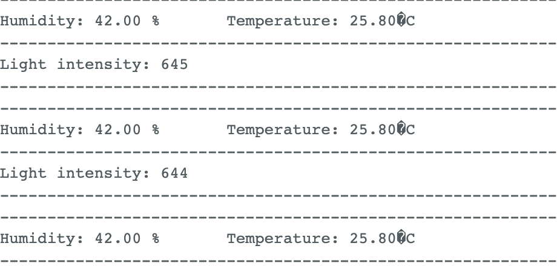

## Timeline
- On the 20. February I tried to connect the DHT and the display -> I got the DHT working after some time but the display didn't work. I tried to connect the display to the D1 mini and the Arduino Uno but it didn't work. One of the tutors said its broken.
  
- On the 21. February, I successfully all sensors I want to use to the Wemos(DHT11, Phtoresistor, LCD-Display and red led to display some useful information). All sensors are working, but I have to change the code to connect them to my backend.

- On the 22. February, I connected the wemos to the wifi manager, restructed the database once again and made a concept for the physical design of the weather station. I also started to work on the backend and the frontend.

