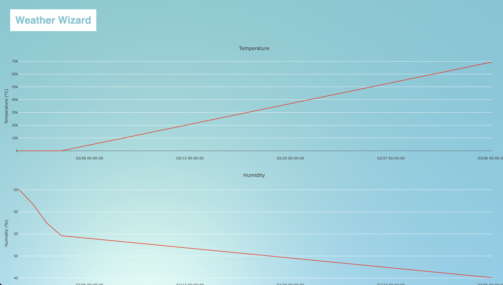

# User Manual

(Reviewed by Rafail)
- Tips adding exact commands to run
- Add exact paths to files
- Add exact names of files
- Maybe add links to download (Will add to second review)


## INTRODUCTION
The Weather Wizard is an IOT device that collects weather data, including temperature, humidity, and light intensity (and soon more), and sends it to the backend where data gets saved in a database. From the backend, the data will be fetched
by the frontend and displayed in graphs. The Weather Wizard is designed for weather enthusiasts, students, and researchers who want to collect accurate weather data.


    

The Weather Wizard's features include:

- Collects temperature, humidity, and light intensity data
- Sends data to a web application for analysis
- Easy to use and set up
- Compact casing


## INSTALLATION INSTRUCTIONS: ARDUINO IDE AND LIBRARIES

To start building your own Weather Wizard, you will need to install the Arduino IDE and all the necessary libraries. Here are the steps to install:


1. Download and install the latest version of the Arduino IDE from the official Arduino website.
2. Open the Arduino IDE and navigate to Sketch > Include Library > Manage Libraries.
3. Search for and install the following libraries:

- LiquidCrystal_I2C
- ESP8266WiFi
- ESP8266HTTPClient
- WiFiClient
- WiFiManager
- Adafruit_DHT


Some of these libraries might be already installed on your computer, others might not.
If you are unsure, you can always check the list of installed libraries by navigating
to Sketch > Include Library > Manage Libraries. If some libraries are not shown
in the findable in the Library manager, then you have to install the .zip file of the library manually.
Usually you find the .zip file under the "Releases" tab of the library's GitHub repository. After downloading them,
from the releases, you can include them like this:


1. Navigate to Sketch > Include Library > Add .ZIP Library.
2. Select the .zip file of the library you want to install.
3. Repeat this step for all the libraries you want to install.


## BUILD INSTRUCTIONS EMBEDDED DEVICE


Here are the steps to build your IoT Weather Station:


1. Gather the necessary components, which are listed under Embedded → BOM and wiring diagram -> BOM
2. Solder the components together according to the wiring diagram, which is also under Embedded → BOM and wiring diagram -> Wiring diagram
3. Place the components in the casing
4. Place the ceiling of the casing on top and glue it in place (preferably with hot glue)


## INSTALLATION INSTRUCTIONS EMBEDDED CODE


To install the code on your embedded device, follow these steps:


1. Clone the repository from GitLab to your computer. You can do that like this:
2. Open a terminal and navigate to the folder where you want to clone the repository.
3. Run the following command:


```
git clone https://gitlab.fdmci.hva.nl/IoT/2022-2023-feb-jun/individual-project/iot-kannenl1.git
```


4. In the IDE navigate to file and then Open. Select the main.ino file in the ./emb directory.
5. Connect your Wemos D1 Mini to your computer and select the USB-C port in the Tools > Port menu.
5. Upload the code by clicking the Upload button.


## NETWORK CONFIGURATION OF EMBEDDED DEVICE


To configure the Wi-Fi network on your Weather Wizard, follow these steps:


1. Power on the Weather Wizard and wait for it to start up.
2. Wait a few seconds until the Wemos starts in AP mode. A Wi-Fi network named "WeatherWizard AutoConnect" will appear.
3. Connect to this Wi-Fi network with your computer or mobile device.
4. A window will open which will ask you to connect to a Wi-Fi network. Go to Scan Network, select your network and enter the password.


## To install Docker Desktop, follow these steps:


1. Download and install Docker Desktop from the official Docker website.
2. Open Docker Desktop and wait for it to start up. It won't work if the Docker Daemon is not running.
3. Open a terminal and run the following command to check if Docker is installed correctly:


```
docker --version
```
It should display the version of Docker that you have installed.


4. Navigate to the folder docker-container which is located in the root directory of the repository.
5. Run the following command to build the Docker image:


```
docker-compose up
```


## USAGE OF EMBEDDED DEVICE


1. Connect the device to a power source.
2. Wait for the Wemos to start up.
3. Wait for the Wemos to connect to the Wi-Fi network or set up a new Wi-Fi network.
4. Start the backend and frontend in their respective Docker containers.
5. Open "localhost" in your browser to access the frontend of the Weather Wizard.


## How the frontend works





The frontend is a web application that displays the weather data in graphs. By using Ajax, it communicates in the background with the
backend to retrieve the weather data. It updates every 10 seconds. By clicking the Logo you can also refresh instantly. You hover over the graphs to get more detailed information about the time and
values of the data points. The graphs are also interactive, you can zoom in and out, take screenshots, and download them as a .png file.
A menu for these functions appears as soon as you hover over one of the graphs.


## API DOCUMENTATION

This API provides CRUD (Create, Read, Update, Delete) operations for managing weather data.


## Methods:

- POST /?action=weather_data - Creates a new weather data point
- PUT /?action=weather_data - Updates an existing weather data point
- DELETE /?action=weather_data - Deletes an existing weather data point
- GET /?action=weather_data - Retrieves all the weather data points

## Parameters:

- timestamp: The timestamp of the weather data point (required)
- new_timestamp: The new timestamp for an updated weather data point
- temperature: The temperature of the weather data point (required)
- humidity: The humidity of the weather data point (required)
- pressure: The pressure of the weather data point (required)
- obstacle_detected: Whether an obstacle was detected (required)
- light_intensity: The light intensity of the weather data point (required)

### __Every request returns a JSON file__
- Success: JSON object with a message
- Failure: JSON object with an error message


# Details


### POST request

To create a new weather data point:


```json
{
    "timestamp": "2022-03-07 12:00:00",
    "temperature": 25,
    "humidity": 70,
    "pressure": 1013,
    "obstacle_detected": false,
    "light_intensity": 100
}
```

Response:
```json
{
    "message": "Weather data added successfully."
}
```


### GET request

To retrieve all the weather data points:


Response:

```json
[
  {
    "timestamp": "2022-12-09",
    "temperature": "69420.3",
    "humidity": "45.1",
    "pressure": "1013.2",
    "obstacle_detected": "1",
    "light_intensity": "800.2"
  },
  {
    "timestamp": "2022-12-10",
    "temperature": "69420.3",
    "humidity": "45.1",
    "pressure": "1013.2",
    "obstacle_detected": "1",
    "light_intensity": "800.2"
  }
]
```

### PUT request
To update an existing weather data point:

Request:

```json
{
"timestamp": "2022-03-07 12:00:00",
"new_timestamp": "2022-03-07 13:00:00",
"temperature": 25,
"humidity": 70,
"pressure": 1013,
"obstacle_detected": false,
"light_intensity": 100
}
```

Response:

```json
{
"message": "Weather data updated successfully."
}
```

### DELETE request

To delete an existing weather data point:

Request:

```json
{
"timestamp": "2022-03-07 12:00:00"
}
```

Response:

```json
{
"message": "Weather data deleted successfully."
}
```

