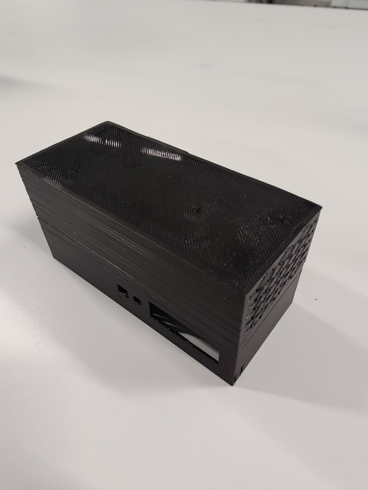
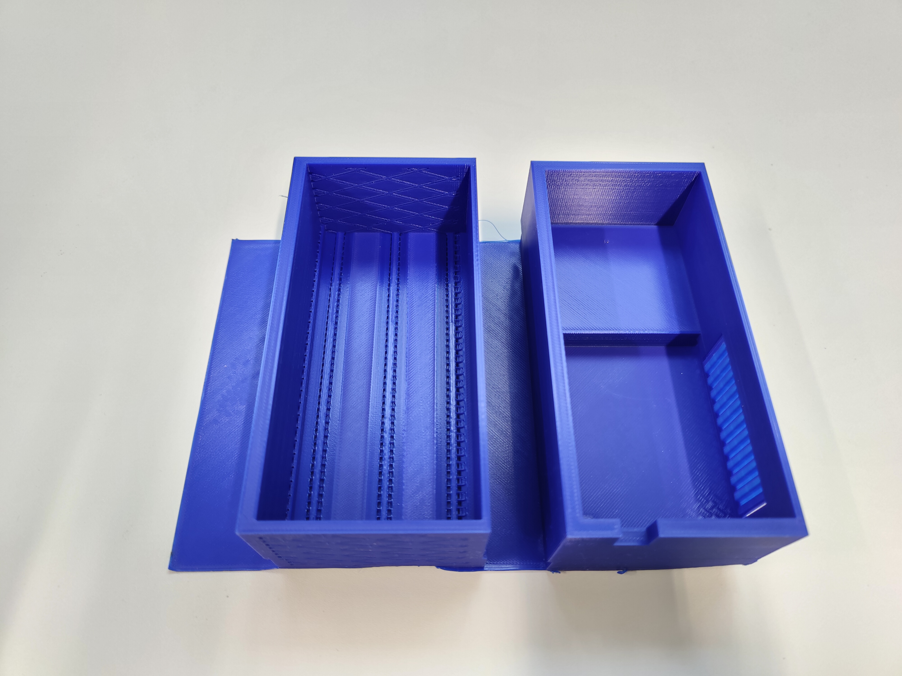
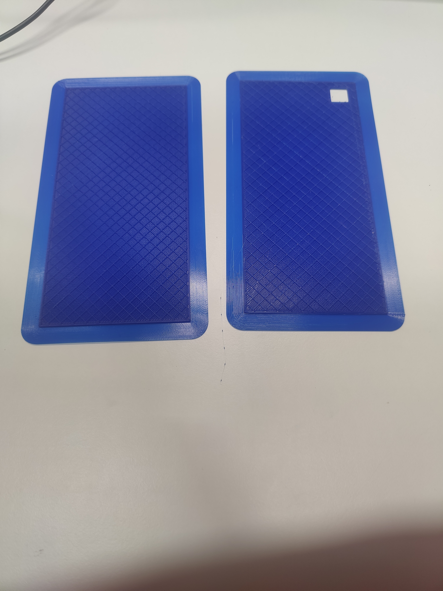
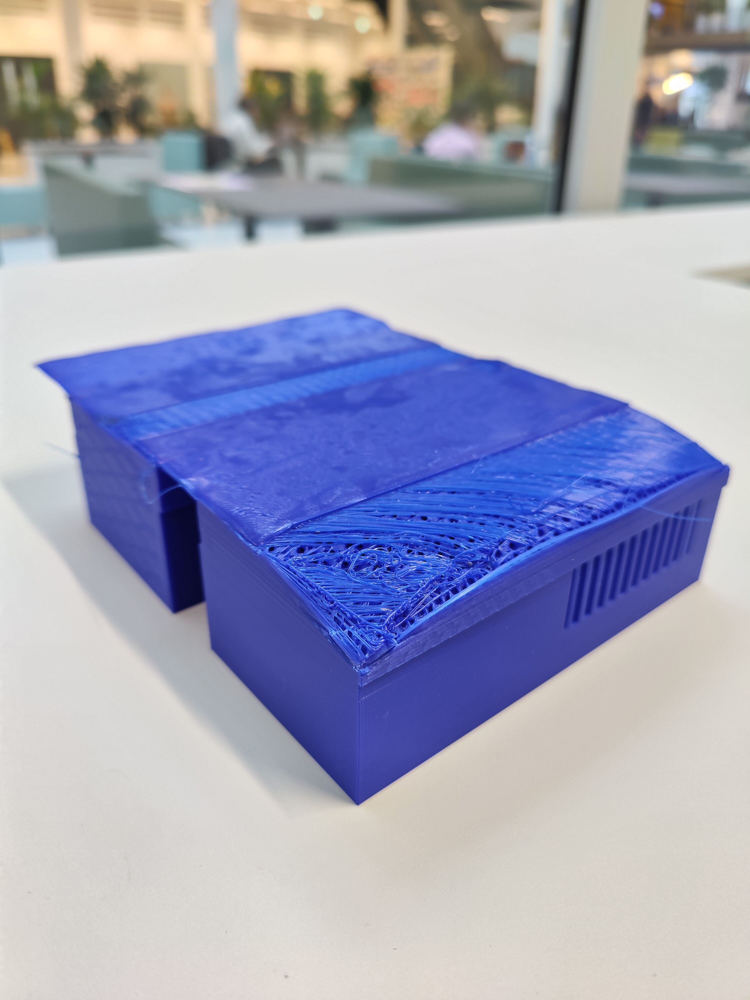
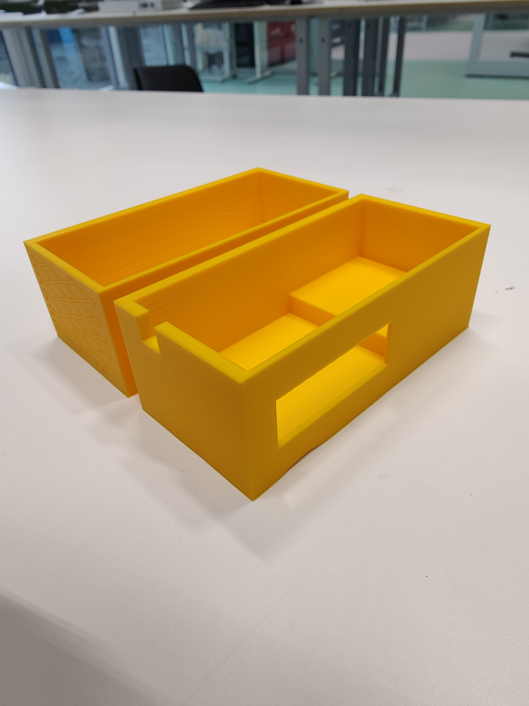
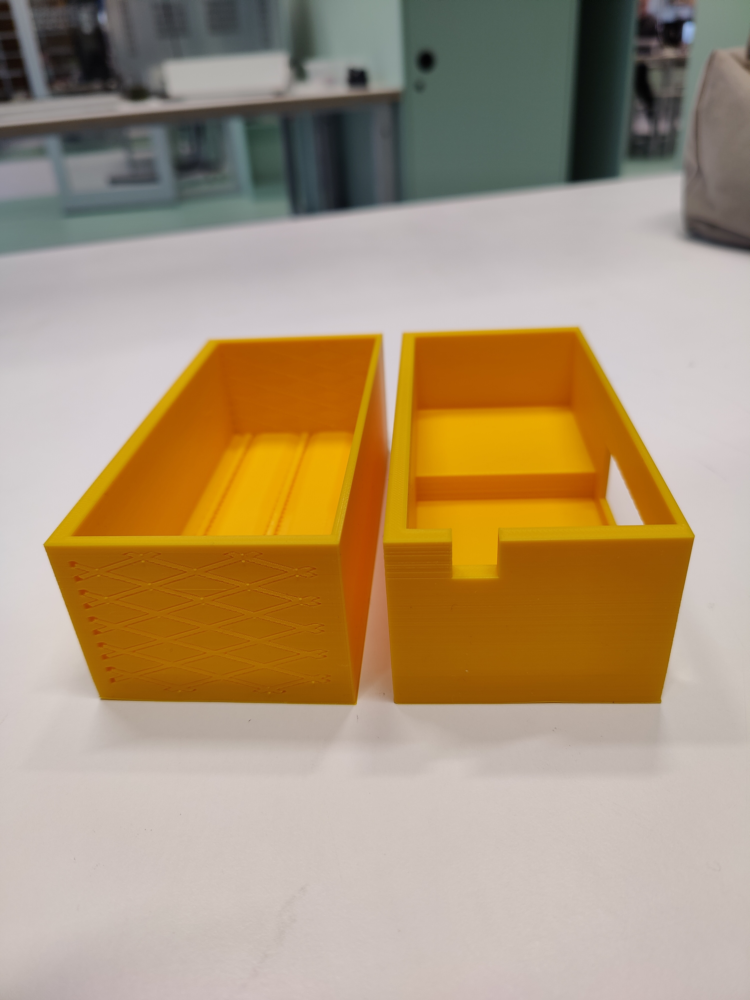
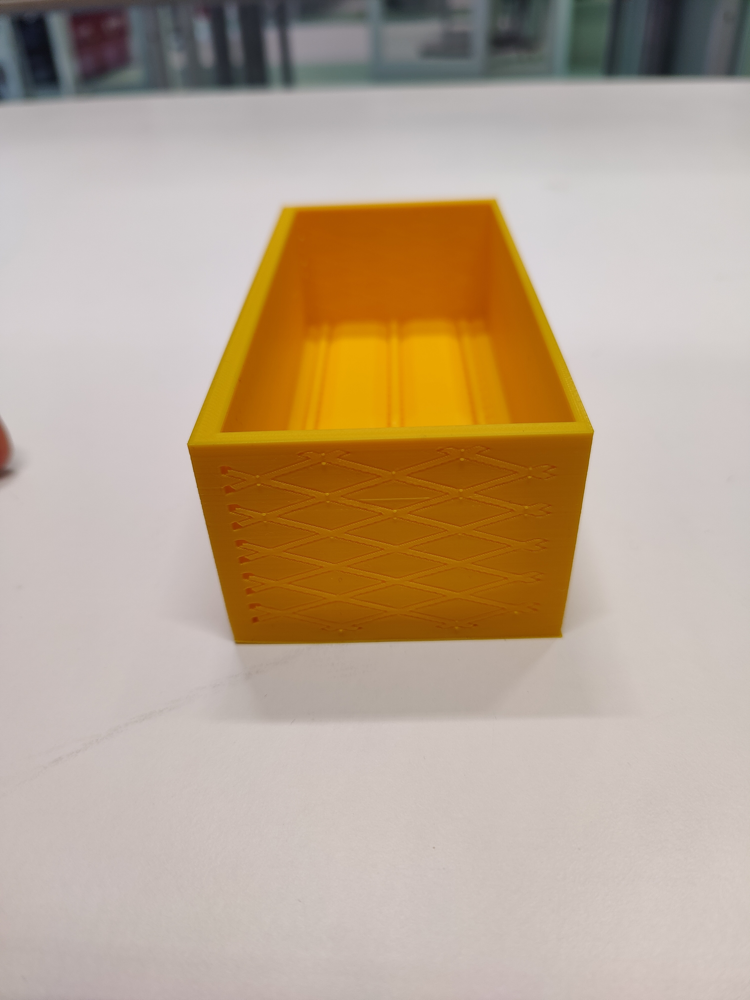
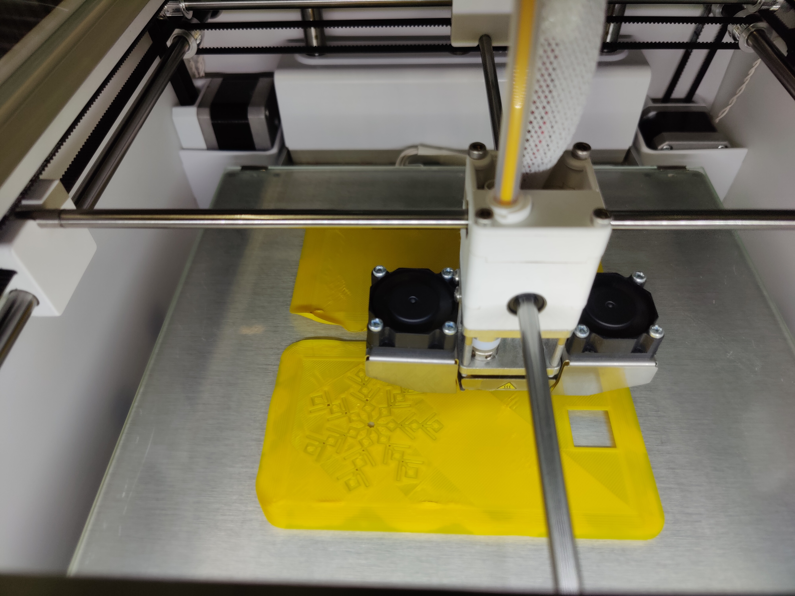
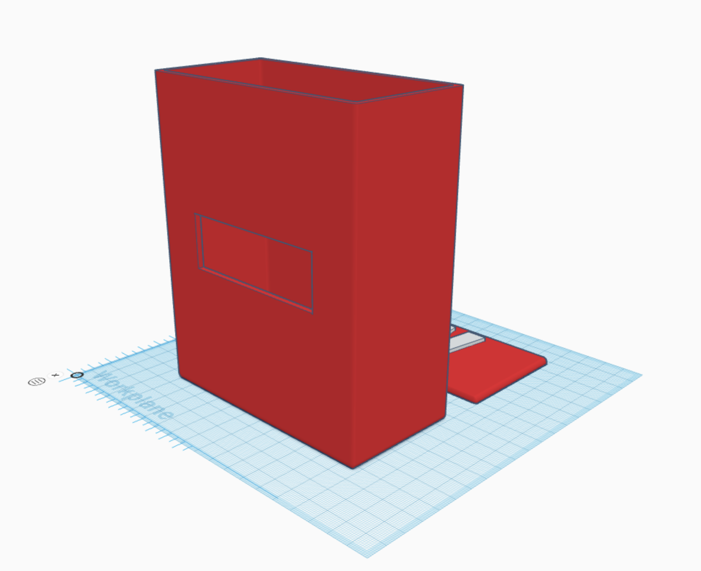
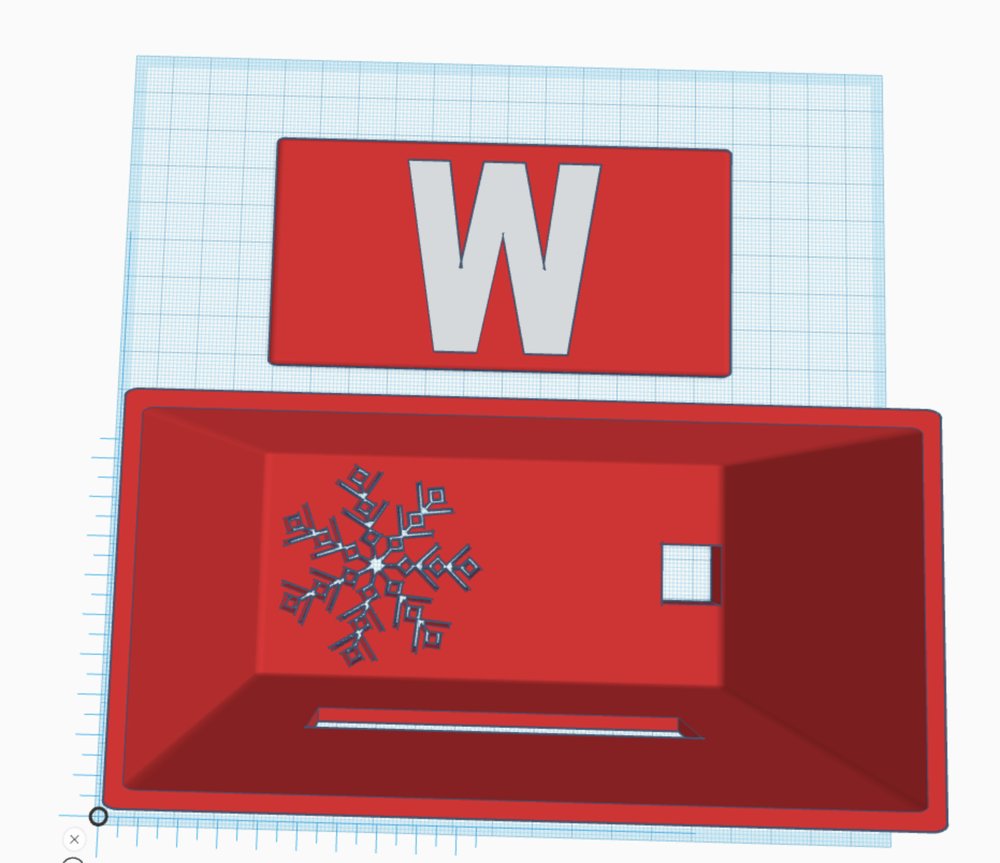

(Reviewed by Rafail)

# Failures in Physical Design
Of course, there are failures in the process of developing a physical design. This document is a collection of failures and solutions to the mistakes that I have made.

## Failure 1: Trying to learn too many things at once
Since I still had my German exams here in Amsterdam, I was not able to work on the project as much as I wanted to. I initially started designing with Tinkercad, but later switched to the more professional software FreeCAD. This was not a good decision because the learning curve of FreeCAD is very steep, and I was not able to invest that much time in learning the software. As a result, I was forced to switch back to Tinkercad. Tinkercad might not be the best software for 3D designing, but it is very easy to learn.

## Failure 2: First prototype

This was the draft before I made the real first prototype. It had many design flaws. Since the size of it was too big, it didn't fit in the 3D printer. I had to scale it down to make it smaller, but this made the design unusable because the measurements for the components were wrong. Another problem was the fact that I wanted to create a case with holes for the sensors already in it. This was a bad idea because I was not entirely sure about which sensors I wanted to use. I printed the case anyway to get a feeling for the result.

In the next iteration, I fixed many of the mentioned problems and created a new design. This time, I changed the sizing and removed the holes for the sensors, so it would fit in the printer.

It also had a few flaws and would be changed later, but it was a good start.

## Failure 3:
The case from the last picture looks good, but I could not print my model because my printer stopped working in the middle of the print. I lost a day of printing and had to reprint it one day later. The staff of the Makerslab thinks that the printer lost power.

The only thing I could do was to print the case again.

## Failure 4:
The blue model from the last picture also had problems with the filament structure at the bottom. They are not visible in this picture, but this picture should give you an idea of the problem:

A possible problem is that the plate of the printer was not properly cleaned before printing. This could be the reason why the filament did not stick to the plate. Printing the exact same model again but with a different printer helped.

This was the result:

## Failure 5:
After fighting with a lot of problems during the printing process, the last yellow model was of course usable, but not perfect. It had an extra layer where I could place the sensors and drill holes for the sensors. It had ventilation holes and cutouts for the cables. The problem was that the ventilation holes were too small, and air couldn't get through. If I made the holes bigger, the case would probably not be waterproof anymore. I had to find a solution for this problem.

My solution was the latest model. It has ventilation holes at the bottom and doesn't have two parts anymore, which should make assembly and printing easier. It also has a cutout for the cables and rounded corners to make it look better.

The model is currently printing:

These are images of the Weather Wizard in the final design

