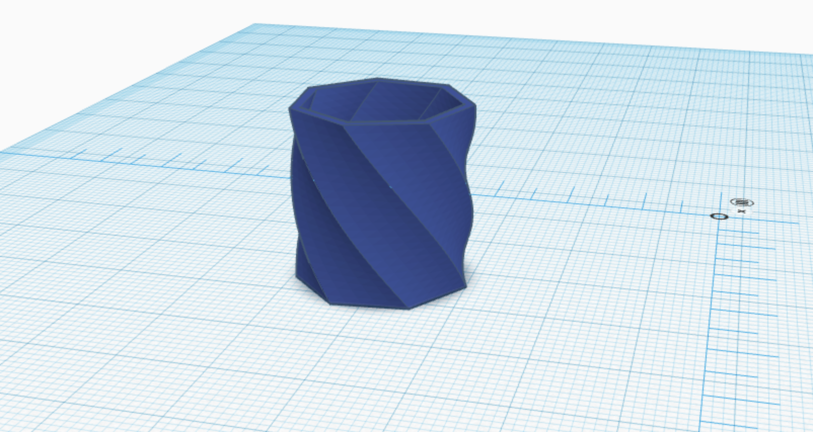
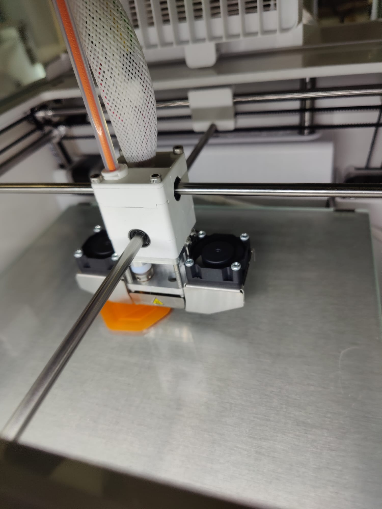
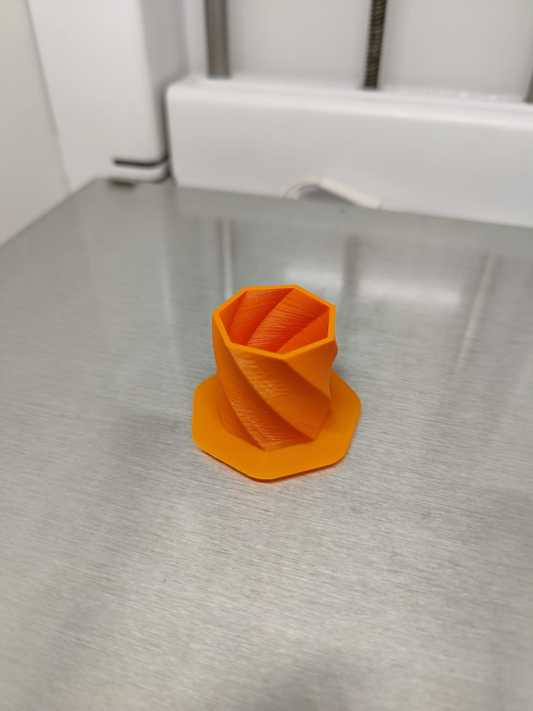

# Failures

### First draft and experimenting with 3D-printing

This is the first draft of the enclosure. It is made of 15 mm thick ABS plastic and is printed on an Ultimaker 3D printer. It was designed with TinkerCAD. However, the shape of the housing is fully unsuitable, therefore probably a rectangular structure is better.

- ### First draft and expermenting with 3D-printing

- ### First draft and expermenting with 3D-printing

- ### First draft and expermenting with 3D-printing
